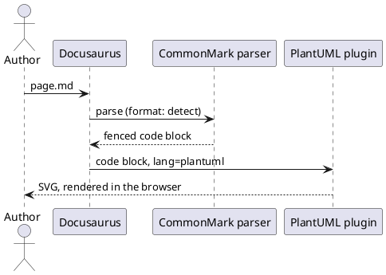
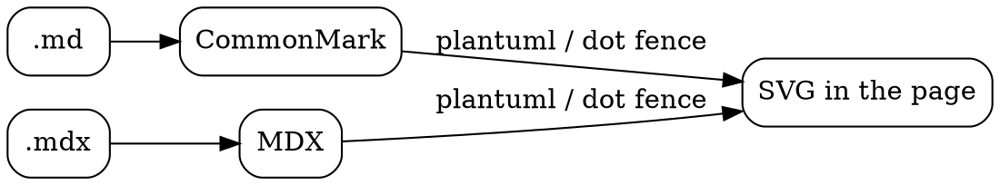
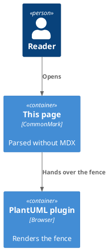

# Diagrams in a CommonMark page

Every other page on this site is `.mdx`. **This page is `.md`**, and the site sets
`markdown: {format: 'detect'}`, so Docusaurus parses it with its CommonMark parser instead
of MDX. The plugin works the same either way: it transforms fenced code blocks, and a fence
is a fence in both dialects.

```ts title="docusaurus.config.ts"
export default {
  markdown: {
    format: 'detect',
  },
};
```

With `detect`, the extension decides: `.mdx` is MDX, `.md` is CommonMark. The alternatives
are `format: 'mdx'` (the default — every file is MDX, whatever its extension) and
`format: 'md'`. A single file can also override the site setting with a `format` entry in
its front matter.

## PlantUML



## Graphviz



## The standard library too

Namespace includes are resolved during the build, well before either parser matters:



## What CommonMark changes

The parser differences are Docusaurus', not the plugin's, and they only affect prose around
the diagrams:

- **No JSX and no imports.** `import` statements and `<MyComponent />` are text or raw HTML
  here, not components. Anything that needs them belongs in an `.mdx` file.
- **Braces are literal.** {this} stays as written instead of being read as a JavaScript
  expression — one of the main reasons to keep legacy `.md` files in CommonMark mode. In an
  `.mdx` file that same sentence fails the build with `this is not defined`, which is the
  quickest way to confirm `format: 'detect'` is actually in effect.
- **Admonitions, front matter, `title=` fence attributes and heading IDs still work**, because
  Docusaurus applies its own remark plugins to both dialects.

:::tip
This admonition is proof of that last point — it is in a `.md` file.
:::

Ordinary code blocks are still left alone on a CommonMark page:

```python
def not_a_diagram(n: int) -> int:
    return n * 2
```
