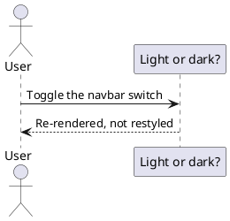
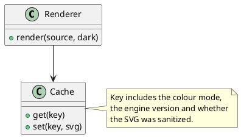

# Dark mode

With `theme: 'auto'` (the default) a diagram follows the site's colour mode. **Toggle the
switch in the navbar and watch these re-render** — they are not recoloured with CSS filters,
they are re-rendered by PlantUML in the matching theme.

Light and dark results are cached under separate keys, so switching back and forth is
instant after the first render of each, and a stale render can never be shown for the wrong
mode.

## Pinning a theme

If you would rather diagrams always look the same, set `theme: 'light'` or `theme: 'dark'` in
the plugin options. The site colour mode is then ignored.
