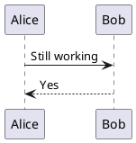

# When a diagram is broken

Invalid PlantUML produces a contained error panel. The rest of the page keeps working, the
render queue keeps processing, and the page never crashes.

Worth knowing: PlantUML does **not** report invalid source through an error callback. It
renders a picture *of* the error and reports success. If a tool does not check for that, it
will happily show you an error image as though it were your diagram. This plugin inspects the
output and turns it into a real error state.

```plantuml title="Deliberately broken"
@startuml
this is definitely not valid ###
Alice ->
@enduml
```

With `showSourceOnError: true` (the default) the original source is available in the
`<details>` block above, so you can see what you actually wrote.

## The queue recovers

A failed render must not wedge the page. This valid diagram sits directly after the broken
one and renders normally:



## Unsupported syntax

A directive the engine does not recognise is reported the same way:

```plantuml title="Not a recognised directive"
@startuml
this-directive-does-not-exist foo bar
@enduml
```

Failure is signalled by an "Error:" label and a ⚠ glyph, not by colour alone.
