# Diagrams taller than the engine's own limit

The bundled PlantUML engine measures every diagram after layout and refuses to serialize one
wider or taller than a fixed number of points, reporting
`Diagram too large for browser rendering`. Upstream that limit is **4096 points** — about
forty stacked class boxes, or seventy steps of an activity diagram. A real release runbook or
domain model passes it without trying.

It is not a limit you can talk your way around from the diagram source. `scale` has no effect,
because the check reads the dimensions _before_ the scale factor is applied. `skinparam dpi`
has no effect either. `left to right direction` only swaps which of the two numbers is too
large.

So the plugin raises it: the engine it serves is patched to accept **32768 points**. The
pipeline below is 95 steps and lays out at 278 × 5667 points — well past the old ceiling — and
renders normally. Use **Fit** in the toolbar to get the whole thing on screen, the minimap to
move around it, and search to jump to a stage by name.

```plantuml title="Release pipeline — from merge to production"
@startuml
start

:Pull request merged to `main`;
:CI workflow triggered;

partition "Prepare" {
  :Check out the repository;
  :Restore the dependency cache;
  :Install dependencies;
  :Verify the lockfile is unchanged;
}

partition "Static checks" {
  :Check formatting;
  :Run the linter;
  :Type-check the workspace;
  :Validate the OpenAPI schema;
  :Check the changelog was updated;
  :Audit dependencies for advisories;
  :Check licences of new dependencies;
  :Scan for leaked secrets;
  :Lint the container definitions;
  :Lint the infrastructure manifests;
}

partition "Test" {
  :Run unit tests;
  :Collect coverage;
  if (Coverage below threshold?) then (yes)
    :Annotate the commit;
    stop
  else (no)
  endif
  :Run integration tests;
  :Run contract tests against the API stub;
  :Replay yesterday's production traffic;
  :Run browser tests on Chromium;
  :Run browser tests on Firefox;
  :Run the visual regression suite;
  :Check for flaky reruns;
  :Upload test artefacts;
}

partition "Build" {
  :Compile the application;
  :Bundle client assets;
  :Check the bundle-size budget;
  :Generate source maps;
  :Generate the SBOM;
  :Build the container image;
  :Reproduce the build and compare digests;
  :Scan the image for vulnerabilities;
  if (Critical finding?) then (yes)
    :Open a security issue;
    :Block the pipeline;
    stop
  else (no)
  endif
  :Sign the image;
  :Push to the registry;
}

partition "Staging" {
  :Render the staging manifests;
  :Apply the manifests;
  :Wait for the rollout to settle;
  :Run database migrations;
  :Warm the caches;
  :Run smoke tests;
  :Run the end-to-end journey suite;
  :Run the accessibility sweep;
  :Check the error budget is intact;
  :Capture a performance baseline;
  if (Baseline regressed?) then (yes)
    :Roll back staging;
    :Notify the owning team;
    stop
  else (no)
  endif
}

partition "Approval" {
  :Assemble the release notes;
  :Diff the infrastructure plan;
  :Post the release summary;
  :Request sign-off;
  if (Approved within the window?) then (no)
    :Expire the candidate;
    stop
  else (yes)
  endif
}

partition "Production" {
  :Open the change record;
  :Silence non-critical alerts;
  :Take a database snapshot;
  :Apply forward-compatible migrations;
  :Scale up the canary pool;
  :Shift 5% of traffic to the canary;
  :Watch error rate and latency;
  :Compare traces against the baseline;
  if (Canary healthy?) then (no)
    :Shift traffic back;
    :Tear down the canary;
    :Page the on-call engineer;
    stop
  else (yes)
  endif
  :Shift 25% of traffic;
  :Shift 50% of traffic;
  :Shift 100% of traffic;
  :Drain the previous revision;
  :Retire the previous revision;
  :Run the destructive migrations;
  :Purge the CDN cache;
  :Restore the alert rules;
  :Close the change record;
}

partition "Afterwards" {
  :Tag the release;
  :Publish the changelog;
  :Close the milestone;
  :Update the status page;
  :Refresh the dependency dashboard;
  :Archive the build artefacts;
  :Retain logs for the audit window;
  :Record deployment metrics;
  :Update the DORA report;
  :Notify the release channel;
  :Schedule the post-release review;
}

stop
@enduml
```



## The same limit, sideways

The ceiling applies to **both** dimensions, so a diagram can be perfectly short and still be
refused for being too wide. The order lifecycle below is drawn with
`left to right direction`, which is the natural shape for a long-running saga — and is exactly
the case where the old 4096-point limit bit hardest, because a wide diagram is not
unreasonable, it is just wide.

A wide diagram never breaks the page layout. The figure stays inside the content column, and
the page never grows a horizontal scrollbar: the SVG is scaled down to the column width, so
the whole diagram is on screen from the start.

The trade-off is legibility, and it is worth seeing. This one lays out at 7111 × 633 points —
an aspect ratio of about 11:1 — so fitting 7111 points into an 800-point column means showing
it at roughly 11%, a band a few dozen pixels tall in which no label is readable. Nothing is
lost, but you have to go and get it: **zoom in** and drag, **maximize** to give it the whole
window, or open the **minimap** to move along the diagram while staying zoomed in. Search
finds a state by name and scrolls it into view.

That is the honest shape of a very wide diagram in a documentation column, and it is a good
reason to reach for `left to right direction` deliberately rather than by habit.

```plantuml title="Order lifecycle — left to right"
@startuml
left to right direction

[*] --> Draft
Draft --> Submitted : customer confirms
Submitted --> PaymentAuthorising : send to PSP
PaymentAuthorising --> PaymentDeclined : declined
PaymentDeclined --> Submitted : retry with new card
PaymentAuthorising --> PaymentAuthorised : approved
PaymentAuthorised --> FraudScreening : risk check
FraudScreening --> ManualReview : score above threshold
ManualReview --> Cancelled : rejected by analyst
ManualReview --> FraudCleared : released by analyst
FraudScreening --> FraudCleared : score below threshold
FraudCleared --> StockReserved : allocate inventory
StockReserved --> Backordered : insufficient stock
Backordered --> StockReserved : restocked
StockReserved --> PickingQueued : send to warehouse
PickingQueued --> Picking : picker assigned
Picking --> Picked : all lines picked
Picked --> Packing : consolidate
Packing --> Packed : sealed and labelled
Packed --> AwaitingCarrier : booked
AwaitingCarrier --> HandedToCarrier : collected
HandedToCarrier --> InTransit : first scan
InTransit --> CustomsHeld : international
CustomsHeld --> InTransit : cleared
InTransit --> OutForDelivery : final depot
OutForDelivery --> DeliveryAttempted : no answer
DeliveryAttempted --> OutForDelivery : retry
DeliveryAttempted --> ReturnedToDepot : attempts exhausted
ReturnedToDepot --> ReturnedToSender : unclaimed
OutForDelivery --> Delivered : signed for
Delivered --> ReturnRequested : customer opens a return
ReturnRequested --> ReturnInTransit : label issued
ReturnInTransit --> ReturnReceived : arrived at warehouse
ReturnReceived --> ReturnInspected : condition checked
ReturnInspected --> RefundPending : accepted
ReturnInspected --> ReturnRejected : damaged
RefundPending --> Refunded : PSP settles
Delivered --> Settled : return window closes
Refunded --> Settled
ReturnRejected --> Settled
ReturnedToSender --> Settled
Cancelled --> Settled
Settled --> [*]

' Side effects fan out from the spine, which is what gives the diagram its height.
Submitted --> OrderConfirmationSent : notify
PaymentAuthorised --> PaymentReceiptSent : notify
HandedToCarrier --> DispatchNoticeSent : notify
InTransit --> TrackingLinkSent : notify
OutForDelivery --> DeliveryWindowSent : notify
Delivered --> DeliveryConfirmationSent : notify
Delivered --> FeedbackRequestSent : after 3 days
Refunded --> RefundConfirmationSent : notify

Picking --> ShortPickRaised : line unavailable
ShortPickRaised --> SubstitutionOffered : alternative found
SubstitutionOffered --> SubstitutionAccepted : customer agrees
SubstitutionOffered --> LineCancelled : customer declines
Packing --> DamagedInPacking : found at packing
DamagedInPacking --> Requeued : replacement picked

Settled --> RevenueRecognised : finance
Settled --> CommissionPosted : finance
Settled --> TaxReported : finance
Settled --> InventoryReconciled : operations
Settled --> CarrierInvoiceMatched : operations
Settled --> ArchivedForAudit : compliance
@enduml
```



## What the old limit looked like

Before the ceiling was raised, this exact diagram produced an error panel rather than a
picture. The engine reports its refusal through the same channel it uses for a syntax error,
so it arrives as a rendering failure with the measured size attached:

```text
Diagram too large for browser rendering: 278x5667 (max 4096)
```

## If you still hit the ceiling

32768 points is a lot of diagram, but it is not infinite, and a diagram that large is a heavy
page: the SVG runs to hundreds of kilobytes and is parsed twice on the main thread on its way
in. If you reach the limit, or the page feels slow, the levers that actually work are the ones
that make the picture smaller:

- fewer nodes and edges — split one diagram into several fences;
- `skinparam ranksep 20` and `skinparam nodesep 20` to tighten the spacing;
- `skinparam defaultFontSize 10` for a smaller overall box size;
- `hide empty members` on class diagrams;
- `left to right direction` when the content is genuinely wider than it is tall.
