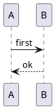
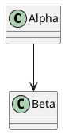
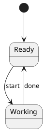
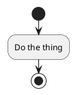
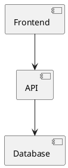
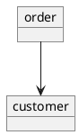

# Several diagrams on one page

The PlantUML engine keeps its in-flight state in module-level globals, so two overlapping
renders corrupt each other. In a browser spike, three concurrent calls produced exactly one
result and two permanent hangs.

The plugin therefore serializes every render through a FIFO queue. This page has six
diagrams; they render one after another, and the runtime is downloaded exactly once.

## Lazy rendering

With `lazy: true` (the default) a diagram is only rendered once it scrolls near the viewport,
using an `IntersectionObserver`. On a long page like this one, the diagrams further down were
almost certainly rendered as you scrolled to them rather than all at once on load.

Browsers without `IntersectionObserver` render immediately instead, so nothing is ever left
permanently blank.
