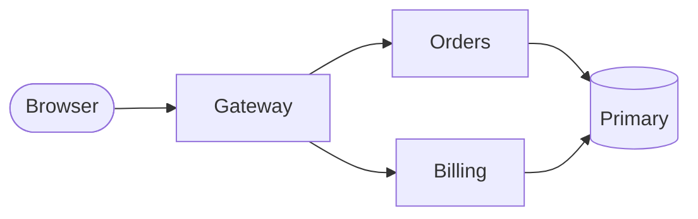
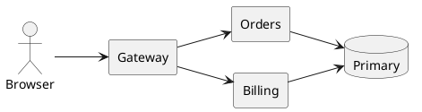
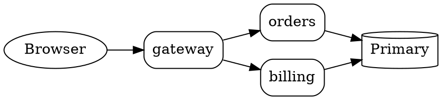
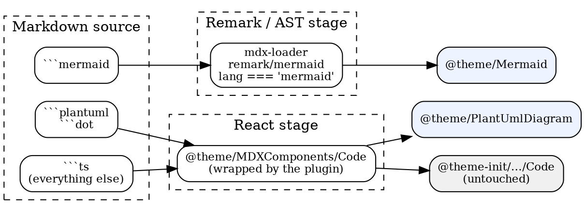
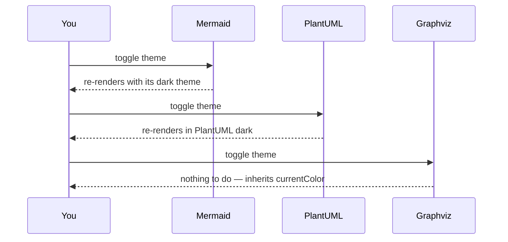
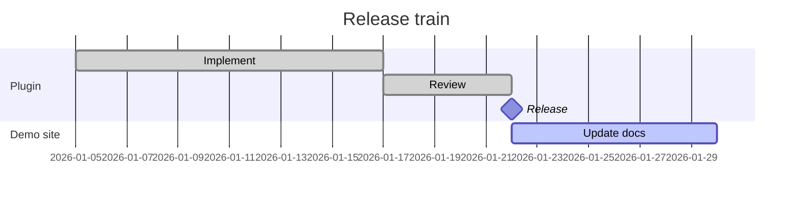
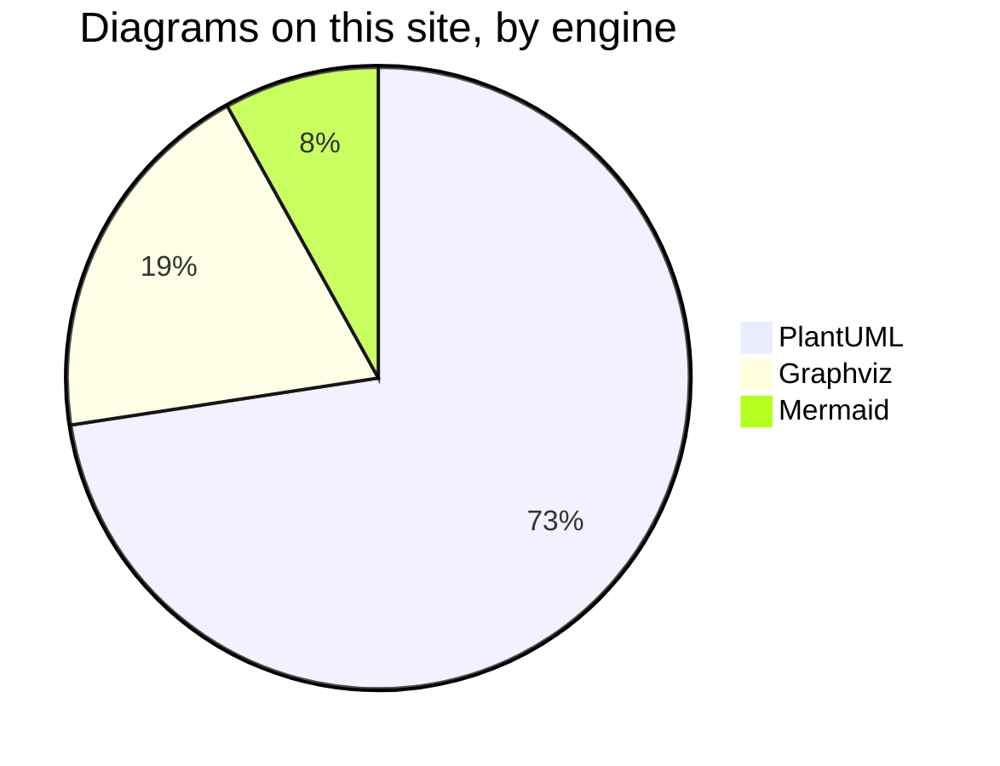
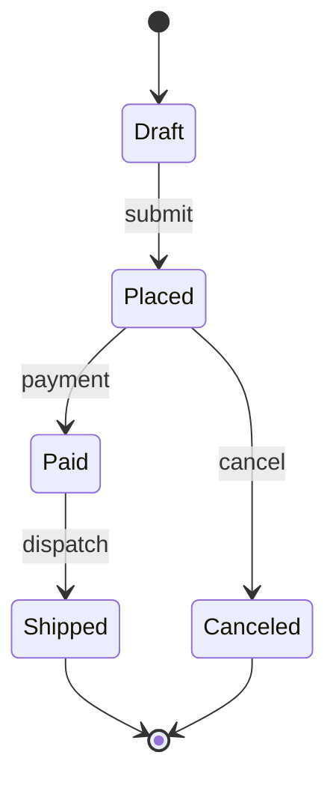
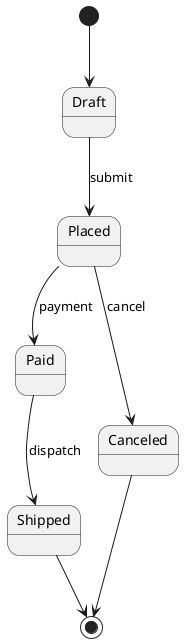

# Alongside Mermaid

This plugin does not replace [Mermaid](https://mermaid.js.org/) and does not compete with it
for your code fences. Both can be installed on the same site, and this page is the proof:
**every diagram below is on one page, rendered by three different engines.**

The Mermaid setup used here is the stock one — `@docusaurus/theme-mermaid`, configured exactly
as its documentation describes — with this plugin added next to it. Nothing on either side was
adjusted to accommodate the other.

## Three engines, one page

Here is the same idea — a request crossing a gateway to two services — drawn three times.







The first is Mermaid. The second and third are this plugin. Nothing had to be configured to
keep them apart.

## The configuration

Two additions to `docusaurus.config.ts`, and both are Mermaid's own stock setup:

```ts title="docusaurus.config.ts"
markdown: {
  mermaid: true,
},

themes: ['@docusaurus/theme-mermaid'],

plugins: [
  ['@matfsw/docusaurus-plantuml-plugin', {languages: ['plantuml', 'puml']}],
],
```

Plus the package itself:

```bash
npm install @docusaurus/theme-mermaid
```

There is no ordering requirement, no `swizzle`, and no opt-out flag on either side. That is
not luck — it falls out of *where* each one hooks in.

## Why they cannot collide

The two integrate with Docusaurus at **different layers**:



**Mermaid never reaches a React code block at all.** `markdown: {mermaid: true}` enables a
remark plugin inside `@docusaurus/mdx-loader` that rewrites the syntax tree before React is
involved. Its entire matching rule is one line:

```js title="@docusaurus/mdx-loader — remark/mermaid/index.ts"
if (node.lang === 'mermaid') {
  transformNode(node, {type: 'mermaidCodeBlock', data: {hName: 'mermaid', /* … */}});
}
```

So a `mermaid` fence stops being a code block and becomes a `<mermaid>` element. By the time
this plugin's wrapper around `@theme/MDXComponents/Code` runs, there is nothing left for it to
see — and it would ignore the fence anyway, because `mermaid` is not in its `languages`.

The component sets are disjoint too. `@docusaurus/theme-mermaid` contributes exactly one
component, `@theme/Mermaid`; this plugin contributes `@theme/MDXComponents/Code` and
`@theme/PlantUmlDiagram`. Neither shadows the other, so the usual Docusaurus hazard — two
themes claiming the same component and the last one silently winning — does not arise.

:::tip Which is the fragile combination, then?

Two plugins that both wrap `@theme/MDXComponents/Code`. Only one wrapper can be the outermost,
so the other is bypassed. That is precisely why PlantUML and Graphviz ship as a *single*
plugin here rather than two — see
[ADR 0004](https://github.com/matf/docusaurus-plantuml-plugin/blob/main/docs/adr/0004-graphviz-engine-reuse.md).
Mermaid sidesteps the problem entirely by not using that extension point.

:::

## Both follow the colour mode

**Toggle the navbar switch.** All three engines respond, by three different mechanisms:



Mermaid re-renders with its own dark theme (configurable under `themeConfig.mermaid`, though
this site leaves it at the default); PlantUML re-renders in the PlantUML dark theme; Graphviz
does not re-render at all, because it draws on a transparent background and inherits the
page's text colour.

You can see the three mechanisms in the DOM. Switching this page to dark changes a Mermaid
node's computed `fill` from `rgb(236,236,255)` to `rgb(31,32,32)` — a new render. The PlantUML
figure's `data-plantuml-theme` flips from `light` to `dark` — also a new render. The Graphviz
SVG is untouched; only its inherited `color` moves, from `rgb(28,30,33)` to `rgb(227,227,227)`.

## What differs

Being able to coexist is not the same as being interchangeable. The honest comparison:

| | Mermaid | This plugin |
|---|---|---|
| Fences | `mermaid` | `plantuml`, `puml`, `dot`, `graphviz`, `gv` (configurable) |
| Hooks into | remark AST | `@theme/MDXComponents/Code` |
| Renders | in the browser | in the browser |
| In the server-rendered HTML | nothing until hydration | a `<figure>` placeholder |
| Payload on a page that uses it | ~169 KB gzipped (`mermaid` chunk) | ~1.4 MB gzipped (`plantuml.js`), plus ~589 KB (`viz-global.js`) — shared by both engines |
| Zoom, pan, minimap, search, source view | — | yes |
| Diagram deep links | — | yes |

Those payload figures are measured from this site's own production build, gzipped. They are
not comparable head-to-head: Mermaid's chunk is the whole of Mermaid, while the plugin's is a
complete PlantUML distribution that also does Graphviz layout. The honest summary is that
Mermaid is much the smaller download, and that adding *Graphviz* to a site already running
this plugin costs nothing, because `viz-global.js` is already there for PlantUML's own layout.

The toolbar is the visible difference on this page. Hover the Mermaid diagram above and then
the PlantUML one: only the latter gets zoom, source view and the rest, because those are
features of `@theme/PlantUmlDiagram`, which Mermaid diagrams never pass through.

That is a reason to pick one per diagram, not a reason to pick one per site. Use whichever
notation suits the diagram — a quick flowchart in Mermaid, a sequence diagram or a C4 model in
PlantUML, a generated dependency graph in DOT — and let the fence decide.

## Mermaid still behaves normally

Nothing about installing this plugin changes how Mermaid works. Its own syntax, including the
diagram types this plugin has no equivalent for:





And a state diagram, next to the PlantUML one it would replace — both render, both are fine:





## Adding it to a site that already has this plugin

```bash
npm install @docusaurus/theme-mermaid
```

```ts title="docusaurus.config.ts"
markdown: {mermaid: true},
themes: ['@docusaurus/theme-mermaid'],
```

That is the entire change. Existing `plantuml`, `puml` and `dot` fences keep rendering exactly
as before — this site is the regression test, since every other page in this sidebar was
written before Mermaid was installed and none of them was touched.
