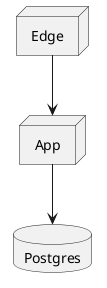
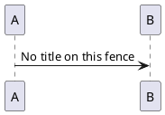
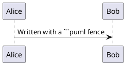

```plantuml title="Deployment topology"
@startuml
...
@enduml
```

# Fence titles and language aliases

## Titles become captions

A `title="..."` on the fence is used as both the `<figcaption>` and the accessible label of
the diagram.

````markdown

````



Without a title, the diagram still gets a sensible accessible label — `PlantUML diagram` —
and no caption is shown:



## The `puml` alias

`puml` works exactly like `plantuml`:

````markdown

````



## Case-insensitive

Docusaurus lower-cases fence languages before highlighting, and this plugin matches the same
way, so `PlantUML`, `PlantUml` and `PUML` all work:

```PlantUML
@startuml
Alice -> Bob: Written with a ```PlantUML fence
@enduml
```

You can change the recognised list entirely with the `languages` option — for example
`languages: ['uml']` if you prefer that fence.
