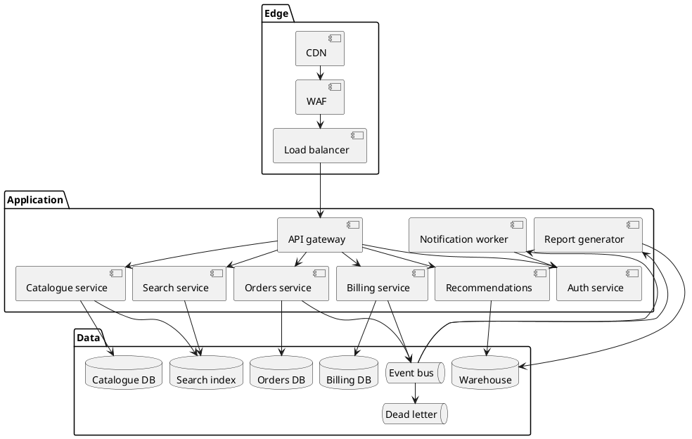
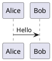
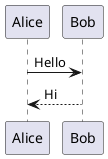

# Zoom and pan

Large diagrams are unreadable at column width, so diagrams are zoomable by default. **Try the
diagram below**: hover it and hold <kbd>Ctrl</kbd> while scrolling, drag it once zoomed, or use
the toolbar in its top-right corner.



## Maximizing

The **⛶** button expands the diagram to fill the browser window over a solid background, fitted
to the space available. <kbd>Escape</kbd> or the same button restores it, along with whatever
zoom level you had before.

This is an in-page overlay rather than the browser's Fullscreen API. `requestFullscreen()`
takes the entire browser window fullscreen in Firefox instead of presenting the diagram, and
its backdrop sits outside the element so the page shows through behind a diagram with a
transparent background. An overlay has neither problem and works the same everywhere —
including iOS Safari, which has no element fullscreen at all.

## How it behaves

| Input                                       | What happens                        |
| ------------------------------------------- | ----------------------------------- |
| Plain scroll wheel                          | Scrolls the page. Never intercepted. |
| <kbd>Ctrl</kbd> + wheel, or trackpad pinch  | Zooms about the pointer              |
| Drag                                        | Pans, once zoomed in                 |
| One finger on a touchscreen                 | Scrolls the page                     |
| Two-finger pinch on a touchscreen           | The browser's own page zoom          |

Plain scrolling is never hijacked, and on a phone a full-width diagram can never become a
scroll trap. <kbd>Cmd</kbd> + wheel is deliberately left alone too — on macOS that is the
browser's page zoom.

## Keyboard

The diagram viewport is focusable. <kbd>Tab</kbd> to it and try:

| Key                                     | Action                      |
| --------------------------------------- | --------------------------- |
| <kbd>+</kbd> / <kbd>=</kbd>             | Zoom in                     |
| <kbd>-</kbd> / <kbd>\_</kbd>            | Zoom out                    |
| <kbd>0</kbd>                            | Reset to 100%               |
| Arrow keys                              | Pan                         |
| <kbd>Shift</kbd> + arrows               | Pan by most of the viewport |

Keys held with <kbd>Ctrl</kbd>, <kbd>Cmd</kbd> or <kbd>Alt</kbd> go to the browser, and
<kbd>Tab</kbd> always moves on — the diagram is never a keyboard trap.

## Opting out

A fence can opt out with `zoom=false`, which is what the diagram below does. It renders exactly
as diagrams did before the feature existed: no toolbar, no focusable viewport, no extra tab
stops.

````markdown

````



Or disable it site-wide:

```ts title="docusaurus.config.ts"
plugins: [['@matfsw/docusaurus-plantuml-plugin', {zoom: false}]],
```

## Notes on the implementation

The transform is applied to a wrapper element, never to the SVG. That keeps the figure's layout
height constant while you zoom — nothing below the diagram moves — and means the sanitized SVG
is never mutated or re-serialized.

Zoom controls sit outside the `role="img"` container, because that role makes its subtree opaque
to assistive technology and a button placed inside would be invisible to screen-reader users.
