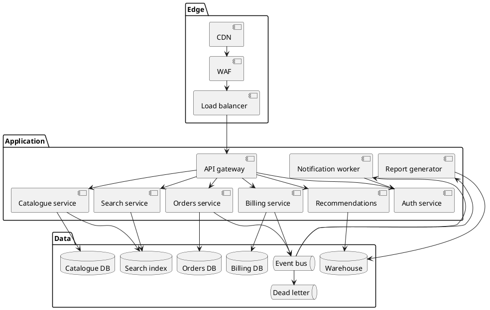
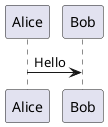
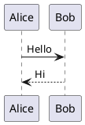

# Zoom and pan

Large diagrams are unreadable at column width, so diagrams are zoomable by default. **Try the
diagram below**: hover it and hold <kbd>Ctrl</kbd> while scrolling, drag it once zoomed, or use
the toolbar in its top-right corner.



## A much larger one

Two hundred nodes across ten clusters, laid out by Graphviz rather than PlantUML — the same
viewer, the same controls. At column width it is a grey smear, which is the point: the minimap
tells you where you are once you have zoomed past it, searching for `payments-store` finds a
node you would otherwise hunt for by hand, and maximizing it opens the whole graph fitted to
the screen — with a **Fit** control to bring it back after you have zoomed off somewhere.

```dot title="Two hundred services"
digraph {
  rankdir=LR;
  compound=true;
  nodesep=0.15;
  ranksep=0.6;
  node [shape=box, style=rounded, fontsize=9, height=0.25, margin="0.06,0.03"];
  edge [arrowsize=0.6, penwidth=0.7];

  subgraph cluster_identity {
    label="identity";
    fontsize=12;
    color="#4a6fa5";
    node [color="#4a6fa5", fontcolor="#4a6fa5"];
    edge [color="#4a6fa5"];
    identity_gateway [label="identity-gateway"];
    identity_api [label="identity-api"];
    identity_router [label="identity-router"];
    identity_resolver [label="identity-resolver"];
    identity_cache [label="identity-cache", shape=cylinder];
    identity_worker [label="identity-worker"];
    identity_queue [label="identity-queue"];
    identity_adapter [label="identity-adapter"];
    identity_store [label="identity-store", shape=cylinder];
    identity_validator [label="identity-validator"];
    identity_sync [label="identity-sync"];
    identity_archiver [label="identity-archiver", shape=cylinder];
    identity_webhook [label="identity-webhook"];
    identity_indexer [label="identity-indexer"];
    identity_exporter [label="identity-exporter"];
    identity_reporter [label="identity-reporter"];
    identity_admin [label="identity-admin"];
    identity_scheduler [label="identity-scheduler"];
    identity_ingest [label="identity-ingest"];
    identity_monitor [label="identity-monitor"];

    identity_gateway -> identity_api;
    identity_api -> identity_router;
    identity_router -> identity_resolver;
    identity_resolver -> identity_cache;
    identity_api -> identity_worker;
    identity_worker -> identity_queue;
    identity_queue -> identity_adapter;
    identity_adapter -> identity_store;
    identity_worker -> identity_validator;
    identity_validator -> identity_store;
    identity_store -> identity_sync;
    identity_sync -> identity_archiver;
    identity_api -> identity_webhook;
    identity_webhook -> identity_queue;
    identity_queue -> identity_indexer;
    identity_indexer -> identity_exporter;
    identity_exporter -> identity_reporter;
    identity_reporter -> identity_admin;
    identity_scheduler -> identity_worker;
    identity_scheduler -> identity_ingest;
    identity_ingest -> identity_store;
    identity_monitor -> identity_api;
    identity_monitor -> identity_worker;
    identity_admin -> identity_store;
  }

  subgraph cluster_payments {
    label="payments";
    fontsize=12;
    color="#a5544a";
    node [color="#a5544a", fontcolor="#a5544a"];
    edge [color="#a5544a"];
    payments_gateway [label="payments-gateway"];
    payments_api [label="payments-api"];
    payments_router [label="payments-router"];
    payments_resolver [label="payments-resolver"];
    payments_cache [label="payments-cache", shape=cylinder];
    payments_worker [label="payments-worker"];
    payments_queue [label="payments-queue"];
    payments_adapter [label="payments-adapter"];
    payments_store [label="payments-store", shape=cylinder];
    payments_validator [label="payments-validator"];
    payments_sync [label="payments-sync"];
    payments_archiver [label="payments-archiver", shape=cylinder];
    payments_webhook [label="payments-webhook"];
    payments_indexer [label="payments-indexer"];
    payments_exporter [label="payments-exporter"];
    payments_reporter [label="payments-reporter"];
    payments_admin [label="payments-admin"];
    payments_scheduler [label="payments-scheduler"];
    payments_ingest [label="payments-ingest"];
    payments_monitor [label="payments-monitor"];

    payments_gateway -> payments_api;
    payments_api -> payments_router;
    payments_router -> payments_resolver;
    payments_resolver -> payments_cache;
    payments_api -> payments_worker;
    payments_worker -> payments_queue;
    payments_queue -> payments_adapter;
    payments_adapter -> payments_store;
    payments_worker -> payments_validator;
    payments_validator -> payments_store;
    payments_store -> payments_sync;
    payments_sync -> payments_archiver;
    payments_api -> payments_webhook;
    payments_webhook -> payments_queue;
    payments_queue -> payments_indexer;
    payments_indexer -> payments_exporter;
    payments_exporter -> payments_reporter;
    payments_reporter -> payments_admin;
    payments_scheduler -> payments_worker;
    payments_scheduler -> payments_ingest;
    payments_ingest -> payments_store;
    payments_monitor -> payments_api;
    payments_monitor -> payments_worker;
    payments_admin -> payments_store;
  }

  subgraph cluster_orders {
    label="orders";
    fontsize=12;
    color="#4a8f5f";
    node [color="#4a8f5f", fontcolor="#4a8f5f"];
    edge [color="#4a8f5f"];
    orders_gateway [label="orders-gateway"];
    orders_api [label="orders-api"];
    orders_router [label="orders-router"];
    orders_resolver [label="orders-resolver"];
    orders_cache [label="orders-cache", shape=cylinder];
    orders_worker [label="orders-worker"];
    orders_queue [label="orders-queue"];
    orders_adapter [label="orders-adapter"];
    orders_store [label="orders-store", shape=cylinder];
    orders_validator [label="orders-validator"];
    orders_sync [label="orders-sync"];
    orders_archiver [label="orders-archiver", shape=cylinder];
    orders_webhook [label="orders-webhook"];
    orders_indexer [label="orders-indexer"];
    orders_exporter [label="orders-exporter"];
    orders_reporter [label="orders-reporter"];
    orders_admin [label="orders-admin"];
    orders_scheduler [label="orders-scheduler"];
    orders_ingest [label="orders-ingest"];
    orders_monitor [label="orders-monitor"];

    orders_gateway -> orders_api;
    orders_api -> orders_router;
    orders_router -> orders_resolver;
    orders_resolver -> orders_cache;
    orders_api -> orders_worker;
    orders_worker -> orders_queue;
    orders_queue -> orders_adapter;
    orders_adapter -> orders_store;
    orders_worker -> orders_validator;
    orders_validator -> orders_store;
    orders_store -> orders_sync;
    orders_sync -> orders_archiver;
    orders_api -> orders_webhook;
    orders_webhook -> orders_queue;
    orders_queue -> orders_indexer;
    orders_indexer -> orders_exporter;
    orders_exporter -> orders_reporter;
    orders_reporter -> orders_admin;
    orders_scheduler -> orders_worker;
    orders_scheduler -> orders_ingest;
    orders_ingest -> orders_store;
    orders_monitor -> orders_api;
    orders_monitor -> orders_worker;
    orders_admin -> orders_store;
  }

  subgraph cluster_catalogue {
    label="catalogue";
    fontsize=12;
    color="#8a5aa5";
    node [color="#8a5aa5", fontcolor="#8a5aa5"];
    edge [color="#8a5aa5"];
    catalogue_gateway [label="catalogue-gateway"];
    catalogue_api [label="catalogue-api"];
    catalogue_router [label="catalogue-router"];
    catalogue_resolver [label="catalogue-resolver"];
    catalogue_cache [label="catalogue-cache", shape=cylinder];
    catalogue_worker [label="catalogue-worker"];
    catalogue_queue [label="catalogue-queue"];
    catalogue_adapter [label="catalogue-adapter"];
    catalogue_store [label="catalogue-store", shape=cylinder];
    catalogue_validator [label="catalogue-validator"];
    catalogue_sync [label="catalogue-sync"];
    catalogue_archiver [label="catalogue-archiver", shape=cylinder];
    catalogue_webhook [label="catalogue-webhook"];
    catalogue_indexer [label="catalogue-indexer"];
    catalogue_exporter [label="catalogue-exporter"];
    catalogue_reporter [label="catalogue-reporter"];
    catalogue_admin [label="catalogue-admin"];
    catalogue_scheduler [label="catalogue-scheduler"];
    catalogue_ingest [label="catalogue-ingest"];
    catalogue_monitor [label="catalogue-monitor"];

    catalogue_gateway -> catalogue_api;
    catalogue_api -> catalogue_router;
    catalogue_router -> catalogue_resolver;
    catalogue_resolver -> catalogue_cache;
    catalogue_api -> catalogue_worker;
    catalogue_worker -> catalogue_queue;
    catalogue_queue -> catalogue_adapter;
    catalogue_adapter -> catalogue_store;
    catalogue_worker -> catalogue_validator;
    catalogue_validator -> catalogue_store;
    catalogue_store -> catalogue_sync;
    catalogue_sync -> catalogue_archiver;
    catalogue_api -> catalogue_webhook;
    catalogue_webhook -> catalogue_queue;
    catalogue_queue -> catalogue_indexer;
    catalogue_indexer -> catalogue_exporter;
    catalogue_exporter -> catalogue_reporter;
    catalogue_reporter -> catalogue_admin;
    catalogue_scheduler -> catalogue_worker;
    catalogue_scheduler -> catalogue_ingest;
    catalogue_ingest -> catalogue_store;
    catalogue_monitor -> catalogue_api;
    catalogue_monitor -> catalogue_worker;
    catalogue_admin -> catalogue_store;
  }

  subgraph cluster_search {
    label="search";
    fontsize=12;
    color="#a58a4a";
    node [color="#a58a4a", fontcolor="#a58a4a"];
    edge [color="#a58a4a"];
    search_gateway [label="search-gateway"];
    search_api [label="search-api"];
    search_router [label="search-router"];
    search_resolver [label="search-resolver"];
    search_cache [label="search-cache", shape=cylinder];
    search_worker [label="search-worker"];
    search_queue [label="search-queue"];
    search_adapter [label="search-adapter"];
    search_store [label="search-store", shape=cylinder];
    search_validator [label="search-validator"];
    search_sync [label="search-sync"];
    search_archiver [label="search-archiver", shape=cylinder];
    search_webhook [label="search-webhook"];
    search_indexer [label="search-indexer"];
    search_exporter [label="search-exporter"];
    search_reporter [label="search-reporter"];
    search_admin [label="search-admin"];
    search_scheduler [label="search-scheduler"];
    search_ingest [label="search-ingest"];
    search_monitor [label="search-monitor"];

    search_gateway -> search_api;
    search_api -> search_router;
    search_router -> search_resolver;
    search_resolver -> search_cache;
    search_api -> search_worker;
    search_worker -> search_queue;
    search_queue -> search_adapter;
    search_adapter -> search_store;
    search_worker -> search_validator;
    search_validator -> search_store;
    search_store -> search_sync;
    search_sync -> search_archiver;
    search_api -> search_webhook;
    search_webhook -> search_queue;
    search_queue -> search_indexer;
    search_indexer -> search_exporter;
    search_exporter -> search_reporter;
    search_reporter -> search_admin;
    search_scheduler -> search_worker;
    search_scheduler -> search_ingest;
    search_ingest -> search_store;
    search_monitor -> search_api;
    search_monitor -> search_worker;
    search_admin -> search_store;
  }

  subgraph cluster_shipping {
    label="shipping";
    fontsize=12;
    color="#4a94a5";
    node [color="#4a94a5", fontcolor="#4a94a5"];
    edge [color="#4a94a5"];
    shipping_gateway [label="shipping-gateway"];
    shipping_api [label="shipping-api"];
    shipping_router [label="shipping-router"];
    shipping_resolver [label="shipping-resolver"];
    shipping_cache [label="shipping-cache", shape=cylinder];
    shipping_worker [label="shipping-worker"];
    shipping_queue [label="shipping-queue"];
    shipping_adapter [label="shipping-adapter"];
    shipping_store [label="shipping-store", shape=cylinder];
    shipping_validator [label="shipping-validator"];
    shipping_sync [label="shipping-sync"];
    shipping_archiver [label="shipping-archiver", shape=cylinder];
    shipping_webhook [label="shipping-webhook"];
    shipping_indexer [label="shipping-indexer"];
    shipping_exporter [label="shipping-exporter"];
    shipping_reporter [label="shipping-reporter"];
    shipping_admin [label="shipping-admin"];
    shipping_scheduler [label="shipping-scheduler"];
    shipping_ingest [label="shipping-ingest"];
    shipping_monitor [label="shipping-monitor"];

    shipping_gateway -> shipping_api;
    shipping_api -> shipping_router;
    shipping_router -> shipping_resolver;
    shipping_resolver -> shipping_cache;
    shipping_api -> shipping_worker;
    shipping_worker -> shipping_queue;
    shipping_queue -> shipping_adapter;
    shipping_adapter -> shipping_store;
    shipping_worker -> shipping_validator;
    shipping_validator -> shipping_store;
    shipping_store -> shipping_sync;
    shipping_sync -> shipping_archiver;
    shipping_api -> shipping_webhook;
    shipping_webhook -> shipping_queue;
    shipping_queue -> shipping_indexer;
    shipping_indexer -> shipping_exporter;
    shipping_exporter -> shipping_reporter;
    shipping_reporter -> shipping_admin;
    shipping_scheduler -> shipping_worker;
    shipping_scheduler -> shipping_ingest;
    shipping_ingest -> shipping_store;
    shipping_monitor -> shipping_api;
    shipping_monitor -> shipping_worker;
    shipping_admin -> shipping_store;
  }

  subgraph cluster_inventory {
    label="inventory";
    fontsize=12;
    color="#a54a7d";
    node [color="#a54a7d", fontcolor="#a54a7d"];
    edge [color="#a54a7d"];
    inventory_gateway [label="inventory-gateway"];
    inventory_api [label="inventory-api"];
    inventory_router [label="inventory-router"];
    inventory_resolver [label="inventory-resolver"];
    inventory_cache [label="inventory-cache", shape=cylinder];
    inventory_worker [label="inventory-worker"];
    inventory_queue [label="inventory-queue"];
    inventory_adapter [label="inventory-adapter"];
    inventory_store [label="inventory-store", shape=cylinder];
    inventory_validator [label="inventory-validator"];
    inventory_sync [label="inventory-sync"];
    inventory_archiver [label="inventory-archiver", shape=cylinder];
    inventory_webhook [label="inventory-webhook"];
    inventory_indexer [label="inventory-indexer"];
    inventory_exporter [label="inventory-exporter"];
    inventory_reporter [label="inventory-reporter"];
    inventory_admin [label="inventory-admin"];
    inventory_scheduler [label="inventory-scheduler"];
    inventory_ingest [label="inventory-ingest"];
    inventory_monitor [label="inventory-monitor"];

    inventory_gateway -> inventory_api;
    inventory_api -> inventory_router;
    inventory_router -> inventory_resolver;
    inventory_resolver -> inventory_cache;
    inventory_api -> inventory_worker;
    inventory_worker -> inventory_queue;
    inventory_queue -> inventory_adapter;
    inventory_adapter -> inventory_store;
    inventory_worker -> inventory_validator;
    inventory_validator -> inventory_store;
    inventory_store -> inventory_sync;
    inventory_sync -> inventory_archiver;
    inventory_api -> inventory_webhook;
    inventory_webhook -> inventory_queue;
    inventory_queue -> inventory_indexer;
    inventory_indexer -> inventory_exporter;
    inventory_exporter -> inventory_reporter;
    inventory_reporter -> inventory_admin;
    inventory_scheduler -> inventory_worker;
    inventory_scheduler -> inventory_ingest;
    inventory_ingest -> inventory_store;
    inventory_monitor -> inventory_api;
    inventory_monitor -> inventory_worker;
    inventory_admin -> inventory_store;
  }

  subgraph cluster_notify {
    label="notify";
    fontsize=12;
    color="#6f7a4a";
    node [color="#6f7a4a", fontcolor="#6f7a4a"];
    edge [color="#6f7a4a"];
    notify_gateway [label="notify-gateway"];
    notify_api [label="notify-api"];
    notify_router [label="notify-router"];
    notify_resolver [label="notify-resolver"];
    notify_cache [label="notify-cache", shape=cylinder];
    notify_worker [label="notify-worker"];
    notify_queue [label="notify-queue"];
    notify_adapter [label="notify-adapter"];
    notify_store [label="notify-store", shape=cylinder];
    notify_validator [label="notify-validator"];
    notify_sync [label="notify-sync"];
    notify_archiver [label="notify-archiver", shape=cylinder];
    notify_webhook [label="notify-webhook"];
    notify_indexer [label="notify-indexer"];
    notify_exporter [label="notify-exporter"];
    notify_reporter [label="notify-reporter"];
    notify_admin [label="notify-admin"];
    notify_scheduler [label="notify-scheduler"];
    notify_ingest [label="notify-ingest"];
    notify_monitor [label="notify-monitor"];

    notify_gateway -> notify_api;
    notify_api -> notify_router;
    notify_router -> notify_resolver;
    notify_resolver -> notify_cache;
    notify_api -> notify_worker;
    notify_worker -> notify_queue;
    notify_queue -> notify_adapter;
    notify_adapter -> notify_store;
    notify_worker -> notify_validator;
    notify_validator -> notify_store;
    notify_store -> notify_sync;
    notify_sync -> notify_archiver;
    notify_api -> notify_webhook;
    notify_webhook -> notify_queue;
    notify_queue -> notify_indexer;
    notify_indexer -> notify_exporter;
    notify_exporter -> notify_reporter;
    notify_reporter -> notify_admin;
    notify_scheduler -> notify_worker;
    notify_scheduler -> notify_ingest;
    notify_ingest -> notify_store;
    notify_monitor -> notify_api;
    notify_monitor -> notify_worker;
    notify_admin -> notify_store;
  }

  subgraph cluster_analytics {
    label="analytics";
    fontsize=12;
    color="#5a5aa5";
    node [color="#5a5aa5", fontcolor="#5a5aa5"];
    edge [color="#5a5aa5"];
    analytics_gateway [label="analytics-gateway"];
    analytics_api [label="analytics-api"];
    analytics_router [label="analytics-router"];
    analytics_resolver [label="analytics-resolver"];
    analytics_cache [label="analytics-cache", shape=cylinder];
    analytics_worker [label="analytics-worker"];
    analytics_queue [label="analytics-queue"];
    analytics_adapter [label="analytics-adapter"];
    analytics_store [label="analytics-store", shape=cylinder];
    analytics_validator [label="analytics-validator"];
    analytics_sync [label="analytics-sync"];
    analytics_archiver [label="analytics-archiver", shape=cylinder];
    analytics_webhook [label="analytics-webhook"];
    analytics_indexer [label="analytics-indexer"];
    analytics_exporter [label="analytics-exporter"];
    analytics_reporter [label="analytics-reporter"];
    analytics_admin [label="analytics-admin"];
    analytics_scheduler [label="analytics-scheduler"];
    analytics_ingest [label="analytics-ingest"];
    analytics_monitor [label="analytics-monitor"];

    analytics_gateway -> analytics_api;
    analytics_api -> analytics_router;
    analytics_router -> analytics_resolver;
    analytics_resolver -> analytics_cache;
    analytics_api -> analytics_worker;
    analytics_worker -> analytics_queue;
    analytics_queue -> analytics_adapter;
    analytics_adapter -> analytics_store;
    analytics_worker -> analytics_validator;
    analytics_validator -> analytics_store;
    analytics_store -> analytics_sync;
    analytics_sync -> analytics_archiver;
    analytics_api -> analytics_webhook;
    analytics_webhook -> analytics_queue;
    analytics_queue -> analytics_indexer;
    analytics_indexer -> analytics_exporter;
    analytics_exporter -> analytics_reporter;
    analytics_reporter -> analytics_admin;
    analytics_scheduler -> analytics_worker;
    analytics_scheduler -> analytics_ingest;
    analytics_ingest -> analytics_store;
    analytics_monitor -> analytics_api;
    analytics_monitor -> analytics_worker;
    analytics_admin -> analytics_store;
  }

  subgraph cluster_platform {
    label="platform";
    fontsize=12;
    color="#7a7a7a";
    node [color="#7a7a7a", fontcolor="#7a7a7a"];
    edge [color="#7a7a7a"];
    platform_gateway [label="platform-gateway"];
    platform_api [label="platform-api"];
    platform_router [label="platform-router"];
    platform_resolver [label="platform-resolver"];
    platform_cache [label="platform-cache", shape=cylinder];
    platform_worker [label="platform-worker"];
    platform_queue [label="platform-queue"];
    platform_adapter [label="platform-adapter"];
    platform_store [label="platform-store", shape=cylinder];
    platform_validator [label="platform-validator"];
    platform_sync [label="platform-sync"];
    platform_archiver [label="platform-archiver", shape=cylinder];
    platform_webhook [label="platform-webhook"];
    platform_indexer [label="platform-indexer"];
    platform_exporter [label="platform-exporter"];
    platform_reporter [label="platform-reporter"];
    platform_admin [label="platform-admin"];
    platform_scheduler [label="platform-scheduler"];
    platform_ingest [label="platform-ingest"];
    platform_monitor [label="platform-monitor"];

    platform_gateway -> platform_api;
    platform_api -> platform_router;
    platform_router -> platform_resolver;
    platform_resolver -> platform_cache;
    platform_api -> platform_worker;
    platform_worker -> platform_queue;
    platform_queue -> platform_adapter;
    platform_adapter -> platform_store;
    platform_worker -> platform_validator;
    platform_validator -> platform_store;
    platform_store -> platform_sync;
    platform_sync -> platform_archiver;
    platform_api -> platform_webhook;
    platform_webhook -> platform_queue;
    platform_queue -> platform_indexer;
    platform_indexer -> platform_exporter;
    platform_exporter -> platform_reporter;
    platform_reporter -> platform_admin;
    platform_scheduler -> platform_worker;
    platform_scheduler -> platform_ingest;
    platform_ingest -> platform_store;
    platform_monitor -> platform_api;
    platform_monitor -> platform_worker;
    platform_admin -> platform_store;
  }

  // Every domain is fronted by the platform edge and reports into analytics.
  edge [color="#999999", style=dashed];
  platform_router -> identity_gateway;
  platform_router -> payments_gateway;
  platform_router -> orders_gateway;
  platform_router -> catalogue_gateway;
  platform_router -> search_gateway;
  platform_router -> shipping_gateway;
  platform_router -> inventory_gateway;
  platform_router -> notify_gateway;
  platform_router -> analytics_gateway;

  identity_exporter -> analytics_ingest;
  payments_exporter -> analytics_ingest;
  orders_exporter -> analytics_ingest;
  catalogue_exporter -> analytics_ingest;
  search_exporter -> analytics_ingest;
  shipping_exporter -> analytics_ingest;
  inventory_exporter -> analytics_ingest;
  notify_exporter -> analytics_ingest;

  // A request path threaded through the domains, so some edges cross the whole graph.
  identity_api -> payments_gateway;
  payments_api -> orders_gateway;
  orders_api -> inventory_gateway;
  inventory_api -> shipping_gateway;
  catalogue_api -> search_gateway;
  search_resolver -> catalogue_cache;
  shipping_queue -> notify_ingest;
  payments_queue -> notify_ingest;
  orders_queue -> notify_ingest;
  analytics_reporter -> platform_admin;
  platform_monitor -> identity_monitor;
  platform_monitor -> payments_monitor;
}
```


## Maximizing

The **⛶** button expands the diagram to fill the browser window over a solid background, fitted
to the space available. <kbd>Escape</kbd> or the same button restores it, along with whatever
zoom level you had before.

This is an in-page overlay rather than the browser's Fullscreen API. `requestFullscreen()`
takes the entire browser window fullscreen in Firefox instead of presenting the diagram, and
its backdrop sits outside the element so the page shows through behind a diagram with a
transparent background. An overlay has neither problem and works the same everywhere —
including iOS Safari, which has no element fullscreen at all.

## How it behaves

| Input                                       | What happens                        |
| ------------------------------------------- | ----------------------------------- |
| Plain scroll wheel                          | Scrolls the page. Never intercepted. |
| <kbd>Ctrl</kbd> + wheel, or trackpad pinch  | Zooms about the pointer              |
| Drag                                        | Pans, once zoomed in                 |
| One finger on a touchscreen                 | Scrolls the page                     |
| Two-finger pinch on a touchscreen           | The browser's own page zoom          |

Plain scrolling is never hijacked, and on a phone a full-width diagram can never become a
scroll trap. <kbd>Cmd</kbd> + wheel is deliberately left alone too — on macOS that is the
browser's page zoom.

## Keyboard

The diagram viewport is focusable. <kbd>Tab</kbd> to it and try:

| Key                                     | Action                      |
| --------------------------------------- | --------------------------- |
| <kbd>+</kbd> / <kbd>=</kbd>             | Zoom in                     |
| <kbd>-</kbd> / <kbd>\_</kbd>            | Zoom out                    |
| <kbd>0</kbd>                            | Reset to 100%               |
| Arrow keys                              | Pan                         |
| <kbd>Shift</kbd> + arrows               | Pan by most of the viewport |

Keys held with <kbd>Ctrl</kbd>, <kbd>Cmd</kbd> or <kbd>Alt</kbd> go to the browser, and
<kbd>Tab</kbd> always moves on — the diagram is never a keyboard trap.

## Opting out

A fence can opt out with `zoom=false`, which is what the diagram below does. It renders exactly
as diagrams did before the feature existed: no toolbar, no focusable viewport, no extra tab
stops.

````markdown

````



Or disable it site-wide:

```ts title="docusaurus.config.ts"
plugins: [['@matfsw/docusaurus-plantuml-plugin', {zoom: false}]],
```

## Notes on the implementation

The transform is applied to a wrapper element, never to the SVG. That keeps the figure's layout
height constant while you zoom — nothing below the diagram moves — and means the sanitized SVG
is never mutated or re-serialized.

Zoom controls sit outside the `role="img"` container, because that role makes its subtree opaque
to assistive technology and a button placed inside would be invisible to screen-reader users.
