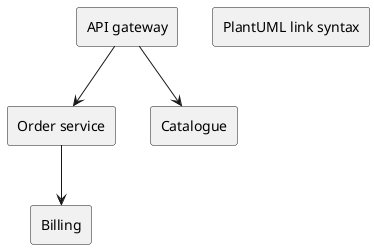
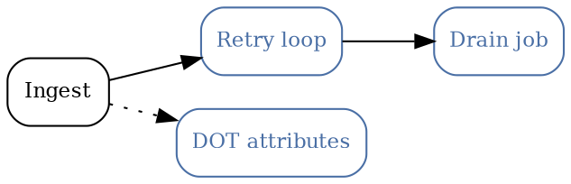

# Links on nodes

The [previous page](./overview.mdx) is about linking _to_ a node. This one is the other
direction: a node in a diagram carrying a link _out_ — to another diagram, on this page or
another one, or to somewhere off the site entirely.

Put the two together and diagrams stop being pictures of a system and start being a way to
move around it: press the box, land on the diagram that explains it, with the right node
already highlighted.

## PlantUML

Write `[[url]]` after the declaration. **Give the node an alias if you link it** — the alias
is what the plugin uses to find the rendered element again:

````markdown
```plantuml
component "Order service" as ORDER_SVC [[/docs/deeplinks/runbook#graph?highlight-node=RETRY_LOOP_9]]
```
````

Every blue node below is a real link. The first two point into the
[runbook](./runbook.mdx), the third leaves the site:



- **Order service** goes to the runbook's retry loop — a PlantUML node linking to another
  **PlantUML** node's deep link.
- **Billing** goes to the runbook's drain job, which is a **Graphviz** diagram. The two
  engines address each other with the same URL; nothing about the hash is engine-specific.
- **PlantUML link syntax** is an external link, and behaves like any other external link.

:::info The plugin synthesizes these anchors

The bundled PlantUML engine parses `[[url]]` but emits no `<a>` elements into its SVG — the
link text is drawn, but nothing is clickable. So the plugin reads the links back out of the
fence source and wraps the rendered elements in real anchors: focusable with <kbd>Tab</kbd>,
coloured with the site's link colour, and marked `data-plantuml-diagram-link` if you want to
restyle them.

Correlation runs on the alias, which is why aliasing matters. Without one, the plugin falls
back to the line number the engine stamps on each element — exact in a plain diagram, but
`!include` renumbers everything, so in a standard-library diagram an unaliased link attaches
to nothing at all. **If you link it, alias it.**

:::

### The unaliased form

For a quick diagram with no includes, the alias is ceremony you can skip:

```plantuml title="No aliases, still linked"
@startuml
skinparam componentStyle rectangle
component "Order service" [[/docs/deeplinks/runbook#graph?highlight-node=RETRY_LOOP_9]]
component "Warehouse"
"Order service" --> "Warehouse"
@enduml
```



## Graphviz

`URL=` on the node, and the engine emits the anchor itself — no synthesis involved:

````markdown
```dot
orders [URL="/docs/deeplinks/runbook#graph?highlight-node=DLQ-DRAIN-2"];
```
````



Same three kinds of destination as the PlantUML diagram: a PlantUML node on another page, a
Graphviz node on another page, and an external site.

## Write the path as `/docs/…`

A site-absolute path in a diagram gets the site's `baseUrl` applied, exactly as a markdown
link does. This site is served from `/docusaurus-plantuml-demo/`, yet every link above is
written `/docs/deeplinks/runbook…` — the prefix is added for you.

That matters more than it sounds: a diagram is often the last place a hardcoded path survives
a move to a different `baseUrl`, because nothing type-checks it and no build step rewrites it.

## How the clicks behave

- **Same-site links go through the router.** No full page load, no white flash — the target
  page arrives like any other Docusaurus navigation, and its diagrams pick up the hash.
- **External links and plain `#…` anchors stay native.** The browser already does the right
  thing with both.
- <kbd>Ctrl</kbd>, <kbd>Cmd</kbd> and <kbd>Shift</kbd> clicks keep their usual meaning, so
  "open in a new tab" works on a diagram node.
- **A click that ends a drag never navigates.** Pan a zoomed diagram, release over a link,
  and nothing happens — which is what you wanted.
- `javascript:` URLs are stripped by sanitization, in both engines.

## Round trip

The runbook links back. Follow
[Billing → the drain job](./runbook.mdx#graph?highlight-node=DLQ-DRAIN-2), and the diagram you
land on has a node pointing back here — a four-hop tour with no scrolling and no reloads:

1. press **Billing** above,
2. land on the runbook's dead-letter drain, node highlighted,
3. press **← Orders DB** there,
4. land back on [Deep links](./overview.mdx) with its Orders DB highlighted.
