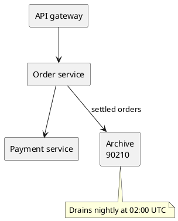
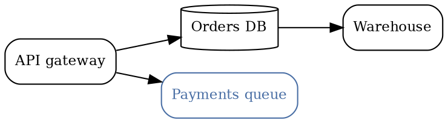

# Deep links into diagrams

A big diagram is a poor thing to link to. You can send someone the page, but not the _node_ —
so the message ends up saying "the archive box, bottom left, next to the queue".

A URL hash of the form `#graph?highlight-node=…` fixes that. It names a node, and:

- **every diagram on the page reacts** — no diagram needs an id of its own, and a diagram that
  does not contain the node simply does nothing;
- the page **scrolls to the first matching figure**, the node is **highlighted**, and a
  zoomable diagram **snaps to 100% centred on it**;
- the hash is watched live, so following such a link from elsewhere on the page focuses the
  node without a reload;
- a `#graph?…` hash **defeats lazy loading**, so a target below the fold still reacts.

It works for both engines. PlantUML nodes are addressed by their alias, Graphviz nodes by an
id, a link, or just their node name.

This page is about linking **to** a node. Nodes can also link **out** — see
[Links on nodes](./from-nodes.mdx).

## PlantUML: addressing by alias

The aliases below never appear in the picture, but the engine writes each one into the
rendered SVG, which is what makes them addressable:

Press these and watch the diagram above:

- [Order service](#graph?highlight-node=ORDER_SERVICE_42) — the alias
  `component "Order service" as ORDER_SERVICE_42`
- [Payment service](#graph?highlight-node=PAYMENT_SERVICE_7) — the same, one node over
- [The note](#graph?highlight-node=ARCHIVE_NOTE_5) — aliased **notes** are addressable too
- [Archive, both label lines](<#graph?highlight-node=Archive%0A90210>) — `%0A` is the newline,
  and the two lines must be consecutive **within one node**
- [Just `90210`](#graph?highlight-node=90210) — the unique half of a label is enough

[Clear the highlight](./overview.mdx) by dropping the hash.

:::tip Aliases are identifiers

`REACTION_1234` parses; `REACTION-1234` does not — PlantUML reads the hyphen as an operator.
Use underscores in PlantUML aliases. Graphviz ids, below, are strings and take either.

:::

## Graphviz: ids, self-links and plain node names

Three different ways to name a node in that graph:

- [Orders DB](#graph?highlight-node=ORDER-DB-1) — an explicit `node [id="ORDER-DB-1"]`, a
  hidden handle that survives any relabelling
- [Payments queue](#graph?highlight-node=PAYMENTS-QUEUE-3) — a `URL="#graph?…"` on the node,
  which is also a real link: **press the blue node in the diagram** and it mints its own
  permalink into the address bar
- [Warehouse](#graph?highlight-node=warehouse) — no annotation at all; the plain DOT node
  name works, because Graphviz writes it into the SVG as a `<title>`

## Across pages

A deep link is a URL, so it works from anywhere — another page, a chat message, a ticket.
These point at the [runbook](./runbook.mdx):

- [The retry loop](./runbook.mdx#graph?highlight-node=RETRY_LOOP_9) — a PlantUML alias on
  another page
- [Draining the dead-letter queue](./runbook.mdx#graph?highlight-node=DLQ-DRAIN-2) — a Graphviz
  id, and one **far below the fold**: the hash defeats lazy loading, so the diagram renders
  and reacts instead of waiting to be scrolled into view
- [Nightly compaction](<./runbook.mdx#graph?highlight-node=Nightly%20compaction>) — matched on
  its label text, with no annotation on the node

A link like these can also live **inside a diagram**, on a node — which is what
[Links on nodes](./from-nodes.mdx) is about.

## How a node is addressed

The identifier is resolved per diagram through a ladder, and the first level that matches
wins — so an author-chosen id always beats loose text matching.

| #   | Level             | Engine   | How you write it                                                    |
| --- | ----------------- | -------- | ------------------------------------------------------------------- |
| 1   | Explicit SVG `id` | Graphviz | `node [id="ORDER-DB-1"]`                                            |
| 2   | Alias             | PlantUML | `component "Orders" as ORDER_SERVICE_42`                            |
| 3   | Self-anchor       | both     | `node [URL="#graph?highlight-node=…"]`, or PlantUML `[[#graph?…]]`  |
| 4   | Node name         | Graphviz | the DOT node name, via its `<title>`                                |
| 5   | Multiline label   | both     | `Archive%0A90210` — consecutive lines, one node                     |
| 6   | Substring         | both     | any text line containing it, case-insensitively                     |

Levels 5 and 6 are the fallback for diagrams nobody annotated: they cost nothing to author,
but they follow the label, so they break when someone rewords it. For a link you intend to
paste into a ticket, spend the id.

## Worth knowing

- **The highlight is restylable.** The focused node carries
  `data-plantuml-focused-node`; the default is the theme's danger colour and an underline.
- **The hash is not a heading anchor.** `#graph?…` is deliberately shaped so it can never
  collide with Docusaurus's own heading ids — but Docusaurus does not know that, so its
  broken-anchor check has to be told to leave these alone. This site sets
  `onBrokenAnchors: 'ignore'`.
- **Links inside a diagram navigate through the router**, in both engines — a node pointing at
  another page arrives without a full page load. See
  [Links on nodes](./from-nodes.mdx#how-the-clicks-behave).
- **The identifier is not the link.** A node is addressable whether or not anything links to
  it, and a node can link out without being addressable itself. The two directions are
  independent; they just happen to meet in the middle when a diagram links to a diagram.
