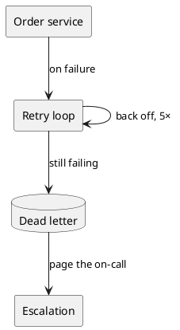
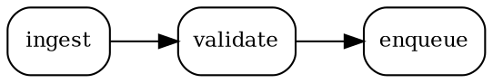
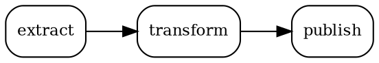
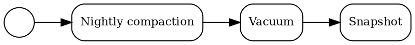
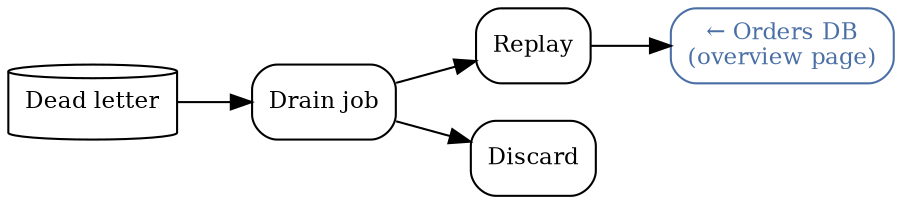

# Runbook

This page exists to be linked _into_. Every diagram on it is addressable from
[the deep links page](./overview.mdx), and it links back the same way.

If you arrived here from a `#graph?highlight-node=…` link, one node below is already
highlighted and centred, and the page has scrolled to it.

## Recovering a stuck order

The PlantUML aliases here are the handles: `RETRY_LOOP_9` and `ESCALATE_3` never appear in
the picture.

- [The retry loop](#graph?highlight-node=RETRY_LOOP_9)
- [Escalation](#graph?highlight-node=ESCALATE_3)
- [Order service](#graph?highlight-node=ORDER_SERVICE_42) — the same alias as the diagram on
  the other page, which is the point: **the same link works on both pages**, and each page
  highlights its own copy

## Every diagram reacts, independently

Neither of the two diagrams below carries an id. Ask for a node and only the diagram that has
it responds — the other one is left alone:

- [`validate`](#graph?highlight-node=validate) — only the ingest path has it
- [`transform`](#graph?highlight-node=transform) — only the reporting path has it
- [`enqueue`](#graph?highlight-node=enqueue) and
  [`publish`](#graph?highlight-node=publish) — one each, again

## Scheduled work

[Nightly compaction](<#graph?highlight-node=Nightly%20compaction>) is addressed by its label
text alone — nothing in that DOT source was written for the sake of the link. `%20` is the
space; a `%0A` would be a newline, matching a two-line label.

## Below the fold

Everything from here down starts life unrendered: with lazy loading on, a diagram waits until
it is nearly on screen. A `#graph?…` hash overrides that for the whole page, so a link can
reach a diagram the reader has never scrolled to.

The diagram at the very bottom of this page is the target of
[Draining the dead-letter queue](#graph?highlight-node=DLQ-DRAIN-2). Follow it from the top of
the page, or from the [other page](./overview.mdx#graph?highlight-node=DLQ-DRAIN-2), and it is
rendered, scrolled to, highlighted and centred without you touching the scrollbar.

### Why lazy loading is worth overriding here

Lazy rendering keeps a long page cheap: the engine renders a diagram when it comes within
300 px of the viewport, so a page of thirty diagrams costs one render on arrival rather than
thirty. But a deep link is a promise that a specific node will be shown, and a promise cannot
be kept by a diagram that has not been rendered.

So the hash flips the whole page to eager rendering — the same cost as `lazy: false`, paid
only when someone actually follows a deep link.

### A wall of text, so the diagram below really is off screen

Scroll past this. It is here so that the last diagram starts outside the viewport on any
reasonable screen, which is what makes the demonstration above honest rather than a diagram
that happened to be visible all along.

Deep links are most useful exactly where they are hardest to implement: on the big, slow,
scrolled-past diagrams that nobody wants rendered up front. A dependency graph of two hundred
services is the one you most want to link into, and the one you least want rendered on
arrival. Overriding lazy loading on the presence of a hash is what lets both be true.

The same reasoning applies to the scroll. A diagram that renders after the browser has already
tried to restore a scroll position would leave the reader somewhere arbitrary, so the figure
scrolls itself into view once it has resolved the target — and only the first figure that
claims a given hash does, which is what stops several matching diagrams fighting over the
viewport.

## Draining the dead-letter queue

The **← Orders DB** node carries a `URL` pointing into the other page's Graphviz diagram —
press it and you land back on
[the deep links page](./overview.mdx#graph?highlight-node=ORDER-DB-1) with its Orders DB
highlighted.

:::note A node that links to a target is also found by it

That back-link node is itself addressable as `ORDER-DB-1`, because a node carrying a
`#graph?highlight-node=X` link is one of the ways the plugin recognises `X` — and it does not
mind that this particular link points at a different page. It is the same rule that makes the
**Payments queue** node on the other page its own permalink; here it means a cross-page link
node answers to the name it points at. Give link nodes their own id if that matters to you.

:::
