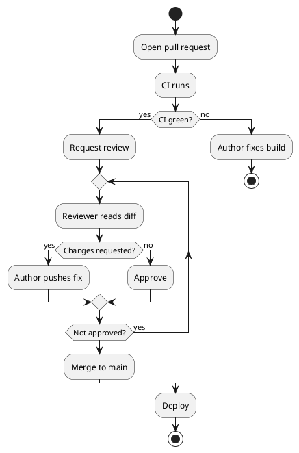
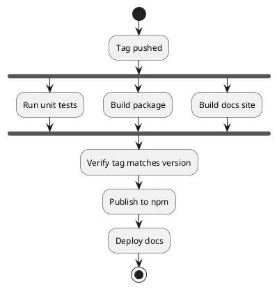
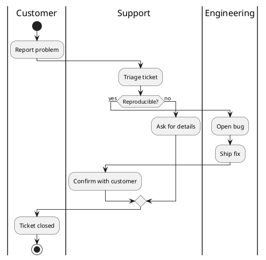

# Activity diagrams

PlantUML's modern activity syntax, with conditionals, parallel work and swimlanes.

```plantuml title="Pull request review"
@startuml
start
:Open pull request;
:CI runs;

if (CI green?) then (yes)
  :Request review;
  repeat
    :Reviewer reads diff;
    if (Changes requested?) then (yes)
      :Author pushes fix;
    else (no)
      :Approve;
    endif
  repeat while (Not approved?) is (yes)
  :Merge to main;
else (no)
  :Author fixes build;
  stop
endif

:Deploy;
stop
@enduml
```

## Parallel work

```plantuml title="Release pipeline"
@startuml
start
:Tag pushed;

fork
  :Run unit tests;
fork again
  :Build package;
fork again
  :Build docs site;
end fork

:Verify tag matches version;
:Publish to npm;
:Deploy docs;
stop
@enduml
```

## Swimlanes

```plantuml title="Support escalation"
@startuml
|Customer|
start
:Report problem;

|Support|
:Triage ticket;
if (Reproducible?) then (yes)
  |Engineering|
  :Open bug;
  :Ship fix;
  |Support|
  :Confirm with customer;
else (no)
  |Support|
  :Ask for details;
endif

|Customer|
:Ticket closed;
stop
@enduml
```
