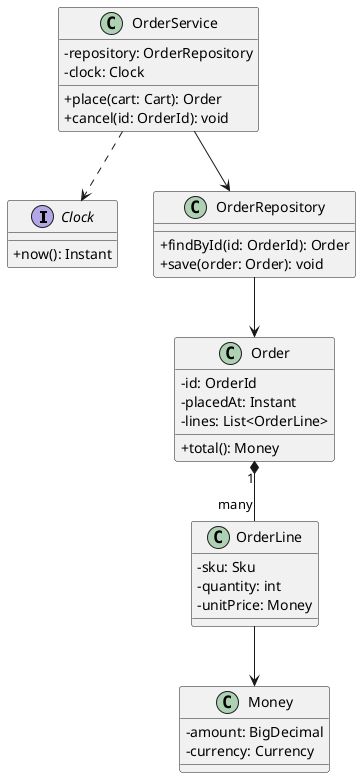
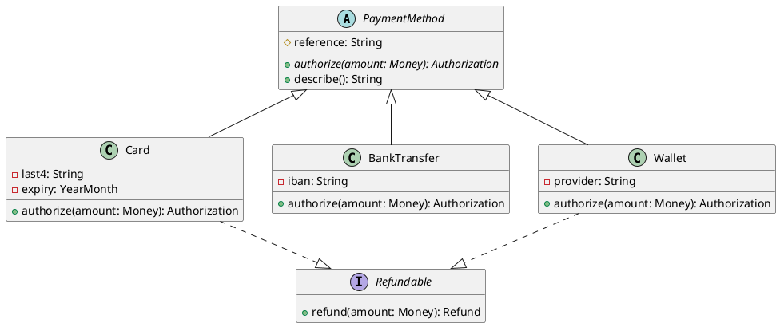
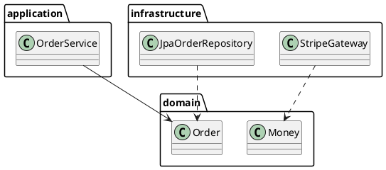

# Class diagrams

Class diagrams are laid out by **Graphviz**, which is compiled to JavaScript and bundled
alongside the PlantUML engine. That is why the runtime is two files: the diagram engine and
the layout engine. Both are served from this site's own origin.

## Inheritance and abstract types

## Packages

