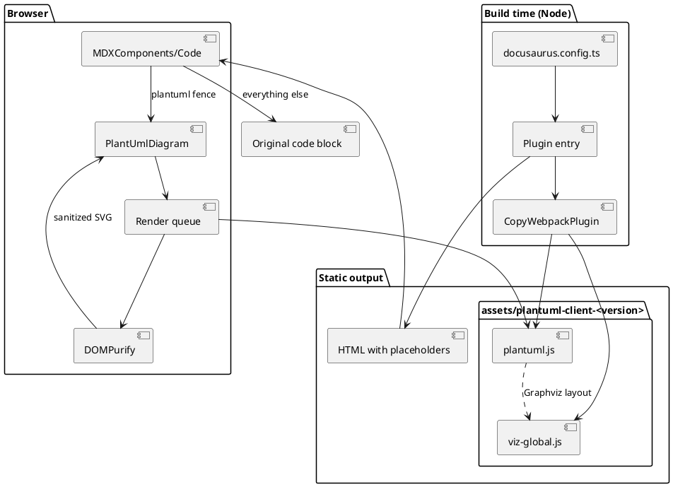
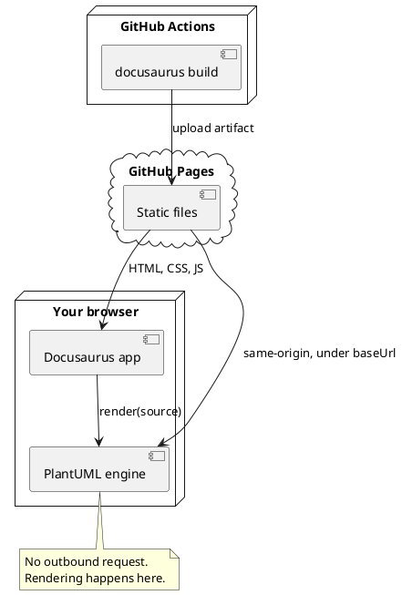

# Component and deployment diagrams

```plantuml title="How the plugin fits together"
@startuml
package "Build time (Node)" {
  [docusaurus.config.ts] as Config
  [Plugin entry] as Plugin
  [CopyWebpackPlugin] as Copy
}

package "Static output" {
  folder "assets/plantuml-client-<version>" {
    [viz-global.js]
    [plantuml.js]
  }
  [HTML with placeholders] as Html
}

package "Browser" {
  [MDXComponents/Code] as Code
  [PlantUmlDiagram] as Diagram
  [Render queue] as Queue
  [DOMPurify] as Purify
}

Config --> Plugin
Plugin --> Copy
Copy --> [viz-global.js]
Copy --> [plantuml.js]
Plugin --> Html

Html --> Code
Code --> Diagram : plantuml fence
Code --> [Original code block] : everything else
Diagram --> Queue
Queue --> [plantuml.js]
[plantuml.js] ..> [viz-global.js] : Graphviz layout
Queue --> Purify
Purify --> Diagram : sanitized SVG
@enduml
```

## Deployment

```plantuml title="This demo site"
@startuml
node "GitHub Actions" {
  [docusaurus build]
}

cloud "GitHub Pages" {
  [Static files]
}

node "Your browser" {
  [Docusaurus app]
  [PlantUML engine]
}

[docusaurus build] --> [Static files] : upload artifact
[Static files] --> [Docusaurus app] : HTML, CSS, JS
[Static files] --> [PlantUML engine] : same-origin, under baseUrl
[Docusaurus app] --> [PlantUML engine] : render(source)

note bottom of [PlantUML engine]
  No outbound request.
  Rendering happens here.
end note
@enduml
```
