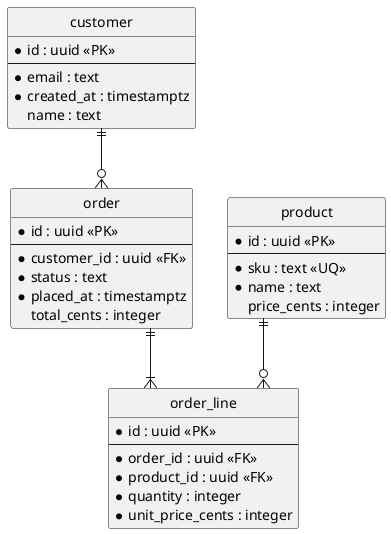

# Entity relationship diagrams

```plantuml title="Shop schema"
@startuml
hide circle
skinparam linetype ortho

entity "customer" as customer {
  *id : uuid <<PK>>
  --
  *email : text
  *created_at : timestamptz
  name : text
}

entity "order" as order {
  *id : uuid <<PK>>
  --
  *customer_id : uuid <<FK>>
  *status : text
  *placed_at : timestamptz
  total_cents : integer
}

entity "order_line" as line {
  *id : uuid <<PK>>
  --
  *order_id : uuid <<FK>>
  *product_id : uuid <<FK>>
  *quantity : integer
  *unit_price_cents : integer
}

entity "product" as product {
  *id : uuid <<PK>>
  --
  *sku : text <<UQ>>
  *name : text
  price_cents : integer
}

customer ||--o{ order
order ||--|{ line
product ||--o{ line
@enduml
```
