# Graphviz diagrams

Everything above is PlantUML. This page is **Graphviz**, written in plain
[DOT](https://graphviz.org/doc/info/lang.html) and laid out in your browser by the same engine.

Write a `dot` fence — or `graphviz`, or `gv` — and that is all:

````markdown
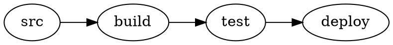
````

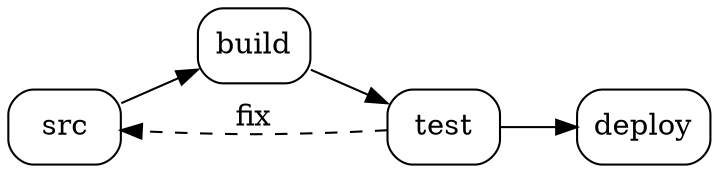

:::tip It costs nothing extra

PlantUML already uses Graphviz for its own layout, so the plugin has been shipping and loading
the Graphviz engine since day one. Rendering DOT reuses it. If your site already renders
PlantUML, **Graphviz support adds zero bytes** to what your readers download.

:::

## Dependency graphs

What DOT is best at: many nodes, many edges, and a layout you would not want to place by hand.

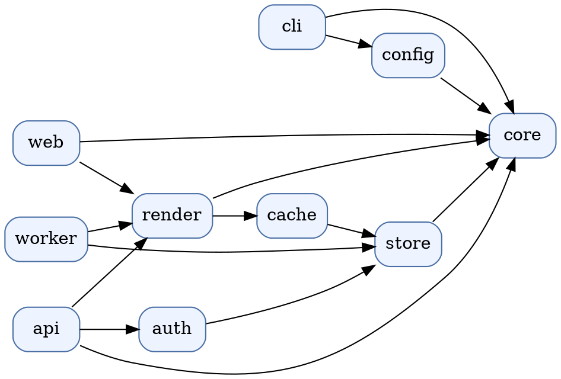

## Clusters

Subgraphs whose name begins with `cluster_` are drawn as boxes — the usual way to show
deployment or ownership boundaries.

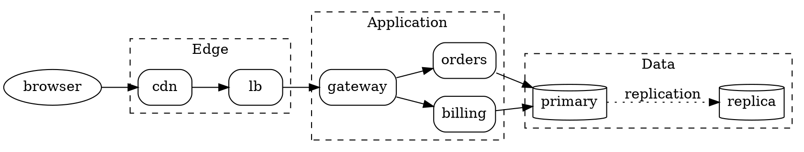

## Layout engines

Graphviz ships eleven layout engines. Add `engine=` to the fence to pick one — the same graph,
laid out four different ways:

````markdown
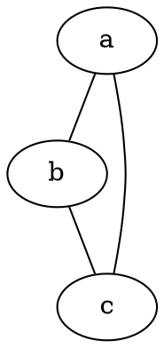
````

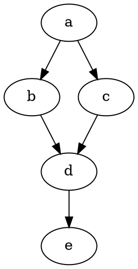

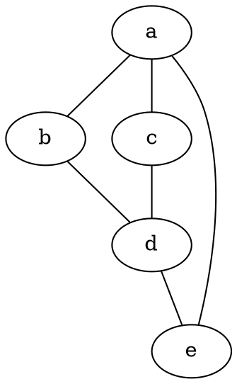

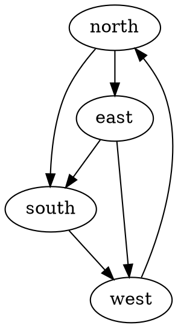

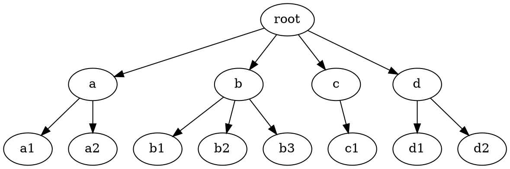

Available engines: `circo`, `dot`, `fdp`, `neato`, `nop`, `nop1`, `nop2`, `osage`,
`patchwork`, `sfdp`, `twopi`.

## Record and table labels

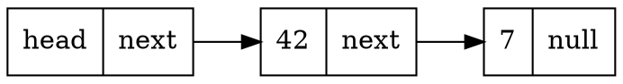

HTML-like labels work too, and render as real SVG text — not as an embedded HTML island:

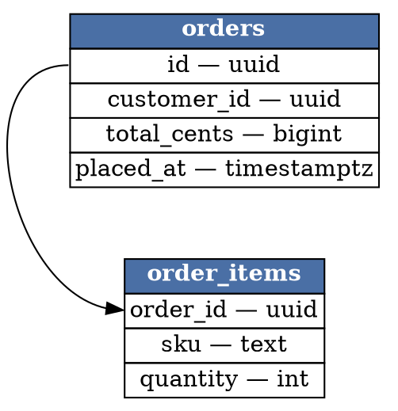

## Colours and dark mode

**Toggle the navbar switch and watch this one.** Graphviz has no dark theme of its own, so the
plugin does not re-render the graph — it renders on a transparent background and lets
Graphviz's default black strokes and text follow the page's text colour.

Anything you colour in the DOT source is left exactly as you wrote it, in both modes:

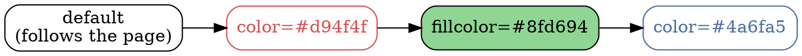

Because nothing is re-rendered, toggling the theme on a page of DOT diagrams costs no layout
work at all — and it does not reset a diagram you have zoomed into.

## State machines

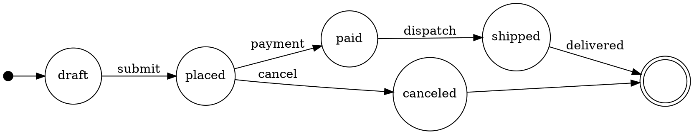

## Links

DOT's `URL` attribute becomes a real link in the rendered SVG. Click a node below.

Rendered SVG is sanitized before it reaches the page, so a `javascript:` URL in a diagram never
survives — the same protection that applies to PlantUML output.


## Zoom works the same

Every diagram on this page is zoomable, exactly like a PlantUML one — hover it, use the
toolbar, or focus it and press `+`, `-`, `0` and the arrow keys.

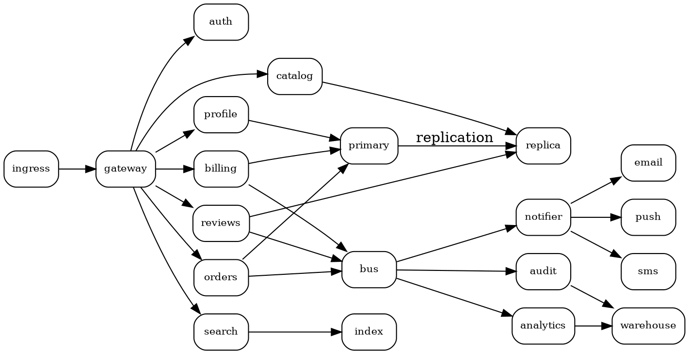

## Invalid DOT

Graphviz reports the offending line, and the plugin shows you exactly what it said — no
guesswork, unlike PlantUML's rendered error pictures:

```dot title="Deliberately broken"
digraph {
  a -> ;
}
```

## Both engines, one page

Nothing stops you mixing them. This is a PlantUML fence, on the same page as all of the above:

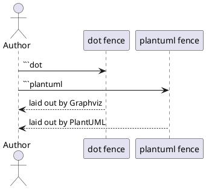
