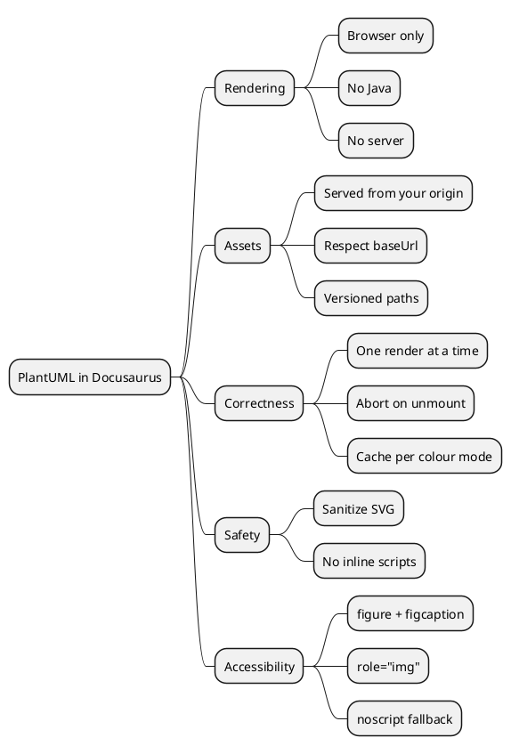
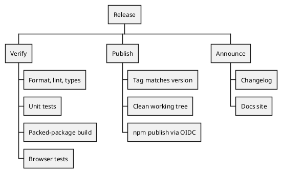
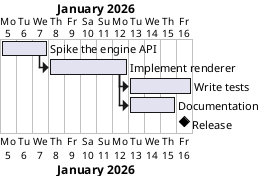

# Mindmaps and work breakdown

PlantUML is not only UML.

```plantuml title="What the plugin has to get right"
@startmindmap
* PlantUML in Docusaurus
** Rendering
*** Browser only
*** No Java
*** No server
** Assets
*** Served from your origin
*** Respect baseUrl
*** Versioned paths
** Correctness
*** One render at a time
*** Abort on unmount
*** Cache per colour mode
** Safety
*** Sanitize SVG
*** No inline scripts
** Accessibility
*** figure + figcaption
*** role="img"
*** noscript fallback
@endmindmap
```

## Work breakdown structure

```plantuml title="Shipping a release"
@startwbs
* Release
** Verify
*** Format, lint, types
*** Unit tests
*** Packed-package build
*** Browser tests
** Publish
*** Tag matches version
*** Clean working tree
*** npm publish via OIDC
** Announce
*** Changelog
*** Docs site
@endwbs
```

## Gantt

```plantuml title="A rough plan"
@startgantt
Project starts 2026-01-05
[Spike the engine API] lasts 3 days
[Implement renderer] lasts 5 days
[Implement renderer] starts at [Spike the engine API]'s end
[Write tests] lasts 4 days
[Write tests] starts at [Implement renderer]'s end
[Documentation] lasts 3 days
[Documentation] starts at [Implement renderer]'s end
[Release] happens at [Write tests]'s end
@endgantt
```
