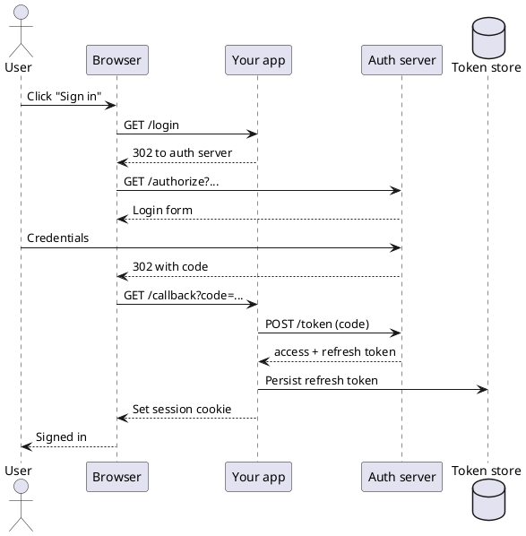
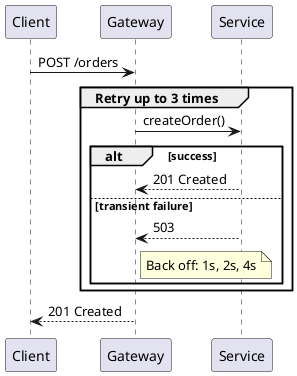
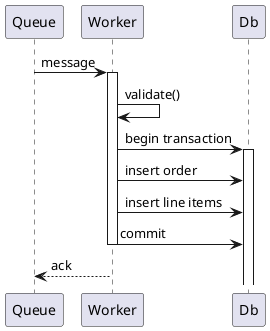

# Sequence diagrams

The classic case, and PlantUML's native layout engine — no Graphviz needed.

```plantuml title="OAuth authorization code flow"
@startuml
actor User
participant "Browser" as B
participant "Your app" as App
participant "Auth server" as Auth
database "Token store" as Store

User -> B: Click "Sign in"
B -> App: GET /login
App --> B: 302 to auth server
B -> Auth: GET /authorize?...
Auth --> B: Login form
User -> Auth: Credentials
Auth --> B: 302 with code
B -> App: GET /callback?code=...
App -> Auth: POST /token (code)
Auth --> App: access + refresh token
App -> Store: Persist refresh token
App --> B: Set session cookie
B --> User: Signed in
@enduml
```

## Grouping, alternatives and notes

```plantuml title="Retry with exponential backoff"
@startuml
participant Client
participant Gateway
participant Service

Client -> Gateway: POST /orders

group Retry up to 3 times
  Gateway -> Service: createOrder()
  alt success
    Service --> Gateway: 201 Created
  else transient failure
    Service --> Gateway: 503
    note right of Gateway
      Back off: 1s, 2s, 4s
    end note
  end
end

Gateway --> Client: 201 Created
@enduml
```

## Lifelines, activation and self-calls

```plantuml title="Order processing"
@startuml
participant Queue
participant Worker
participant Db

Queue -> Worker ++: message
Worker -> Worker: validate()
Worker -> Db ++: begin transaction
Worker -> Db: insert order
Worker -> Db: insert line items
Worker -> Db --: commit
Worker --> Queue --: ack
@enduml
```
