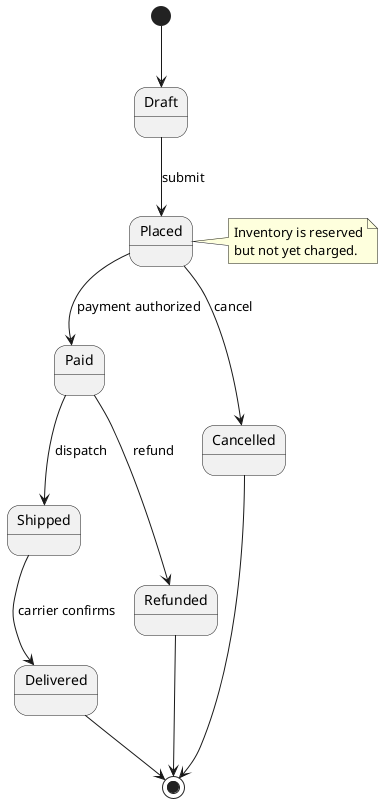
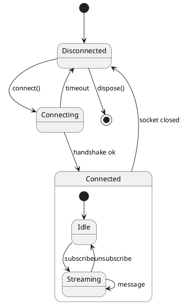

# State diagrams

```plantuml title="Order lifecycle"
@startuml
[*] --> Draft

Draft --> Placed : submit
Placed --> Paid : payment authorized
Placed --> Cancelled : cancel
Paid --> Shipped : dispatch
Shipped --> Delivered : carrier confirms
Delivered --> [*]

Paid --> Refunded : refund
Cancelled --> [*]
Refunded --> [*]

note right of Placed
  Inventory is reserved
  but not yet charged.
end note
@enduml
```

## Composite states

```plantuml title="Connection handling"
@startuml
[*] --> Disconnected

state Connected {
  [*] --> Idle
  Idle --> Streaming : subscribe
  Streaming --> Idle : unsubscribe
  Streaming --> Streaming : message
}

Disconnected --> Connecting : connect()
Connecting --> Connected : handshake ok
Connecting --> Disconnected : timeout
Connected --> Disconnected : socket closed
Disconnected --> [*] : dispose()
@enduml
```
