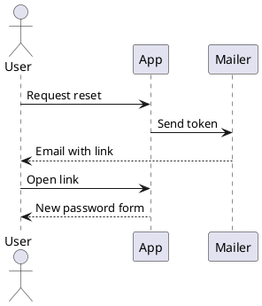

# PlantUML diagrams in Docusaurus

Every diagram on this site was rendered **by your browser**, from PlantUML source embedded in
Markdown. No diagram source was sent anywhere. There is no PlantUML server, no Kroki, no
Java, and no CDN involved.

Open your browser's network tab and look: the only requests are to this site's own origin.

## Install

```bash
npm install @matfsw/docusaurus-plantuml-plugin
```

```ts title="docusaurus.config.ts"
import type {PlantUmlPluginOptions} from '@matfsw/docusaurus-plantuml-plugin';

export default {
  plugins: [
    [
      '@matfsw/docusaurus-plantuml-plugin',
      {theme: 'auto', lazy: true} satisfies PlantUmlPluginOptions,
    ],
  ],
};
```

That is the entire setup. No swizzling, no per-page imports.

## Write a diagram

Put PlantUML in a fenced code block using the `plantuml` (or `puml`) language:

````markdown

````

Which renders as:


## Options

Every option is optional. These are the defaults:

| Option              | Default                  | What it does                                                    |
| ------------------- | ------------------------ | --------------------------------------------------------------- |
| `languages`         | `['plantuml', 'puml']`   | Fence languages treated as PlantUML. Matched case-insensitively. |
| `theme`             | `'auto'`                 | `auto` follows the site colour mode; or pin `light` / `dark`.    |
| `lazy`              | `true`                   | Render only when the diagram nears the viewport.                 |
| `cache`             | `'memory'`               | `none`, `memory`, or `session` (survives page reloads).          |
| `sanitizeSvg`       | `true`                   | Run rendered SVG through DOMPurify before inserting it.          |
| `showSourceOnError` | `true`                   | Offer the source in a `<details>` block when rendering fails.    |
| `renderTimeoutMs`   | `20000`                  | Abort a single render after this long.                           |
| `cacheMaxEntries`   | `50`                     | Bound on cached diagrams.                                        |

Invalid option values fail the build with an explicit message rather than being ignored.

## What to look at

The **Diagram gallery** shows the range of diagram types the engine supports, including the
ones that need Graphviz layout.

**Plugin behaviour** demonstrates the things that are easy to get wrong: dark mode, several
diagrams on one page, invalid source, and leaving ordinary code blocks alone.

The [playground](/playground) lets you type your own PlantUML and watch it render as you go —
same renderer, same browser, still no network call.
