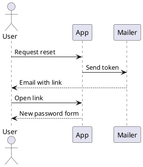
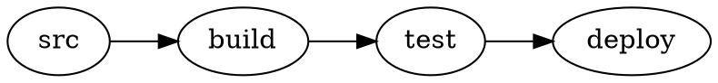
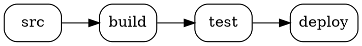

# PlantUML and Graphviz diagrams in Docusaurus

Every diagram on this site was rendered **by your browser**, from PlantUML or Graphviz source
embedded in Markdown. No diagram source was sent anywhere. There is no PlantUML server, no
Kroki, no Java, no Graphviz installation, and no CDN involved.

Open your browser's network tab and look: the only requests are to this site's own origin.

## Install

```bash
npm install @matfsw/docusaurus-plantuml-plugin
```

```ts title="docusaurus.config.ts"
import type {PlantUmlPluginOptions} from '@matfsw/docusaurus-plantuml-plugin';

export default {
  plugins: [
    [
      '@matfsw/docusaurus-plantuml-plugin',
      {theme: 'auto', lazy: true} satisfies PlantUmlPluginOptions,
    ],
  ],
};
```

That is the entire setup. No swizzling, no per-page imports.

## Write a diagram

Put PlantUML in a fenced code block using the `plantuml` (or `puml`) language:

````markdown

````

Which renders as:


## …or write Graphviz

`dot`, `graphviz` and `gv` fences are laid out by Graphviz instead:

````markdown

````

Which renders as:



**This costs nothing extra.** PlantUML uses Graphviz for its own layout, so the plugin has
always shipped and loaded the Graphviz engine. DOT fences reuse it — if your site already
renders PlantUML, Graphviz support adds zero bytes to what your readers download. The reverse
holds too: a page with only DOT diagrams never fetches the much larger PlantUML engine.

See the [Graphviz gallery page](/docs/gallery/graphviz) for layout engines, clusters, record
and HTML labels, and how colours behave in dark mode.

## Options

Every option is optional. These are the defaults:

| Option              | Default                  | What it does                                                    |
| ------------------- | ------------------------ | --------------------------------------------------------------- |
| `languages`         | `['plantuml', 'puml']`   | Fence languages treated as PlantUML. Matched case-insensitively. |
| `theme`             | `'auto'`                 | `auto` follows the site colour mode; or pin `light` / `dark`.    |
| `lazy`              | `true`                   | Render only when the diagram nears the viewport.                 |
| `cache`             | `'memory'`               | `none`, `memory`, or `session` (survives page reloads).          |
| `sanitizeSvg`       | `true`                   | Run rendered SVG through DOMPurify before inserting it.          |
| `showSourceOnError` | `true`                   | Offer the source in a `<details>` block when rendering fails.    |
| `renderTimeoutMs`   | `20000`                  | Abort a single render after this long.                           |
| `cacheMaxEntries`   | `50`                     | Bound on cached diagrams.                                        |
| `zoom`              | `true`                   | Let readers zoom and pan. Override per fence with `zoom=false`.  |
| `graphviz`          | see below                | Graphviz/DOT support.                                            |

Everything except `theme` applies to both engines. `theme` is PlantUML-only: Graphviz has no
dark palette, so its colours are adapted with CSS instead of being re-rendered.

### Graphviz options

| Option                            | Default                     | What it does                                                     |
| --------------------------------- | --------------------------- | ---------------------------------------------------------------- |
| `graphviz.enabled`                | `true`                      | Intercept DOT fences. `false` leaves them as code blocks.        |
| `graphviz.languages`              | `['dot', 'graphviz', 'gv']` | Fence languages treated as Graphviz.                             |
| `graphviz.engine`                 | `'dot'`                     | Default layout engine.                                           |
| `graphviz.allowEngineOverride`    | `true`                      | Let a fence pick its own engine with `engine=neato`.             |
| `graphviz.maxSourceBytes`         | `100000`                    | Refuse larger sources — Graphviz lays out synchronously.         |
| `graphviz.transparentBackground`  | `true`                      | Drop Graphviz's opaque white background.                         |

Invalid option values fail the build with an explicit message rather than being ignored — one
level deep too, so `graphviz: {enigne: 'neato'}` is a build error rather than a silent no-op.

## What to look at

The **Diagram gallery** shows the range of diagram types PlantUML supports, including the ones
that need Graphviz layout, and finishes with a [Graphviz page](/docs/gallery/graphviz) written
in plain DOT.

**Plugin behaviour** demonstrates the things that are easy to get wrong: dark mode, several
diagrams on one page, invalid source, and leaving ordinary code blocks alone.

The [playground](/playground) lets you type your own PlantUML and watch it render as you go —
same renderer, same browser, still no network call.
