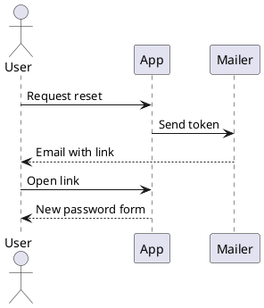
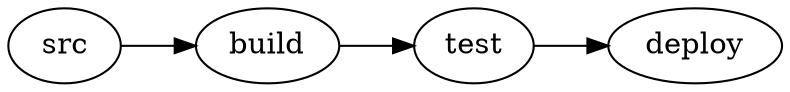
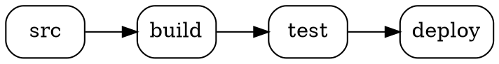
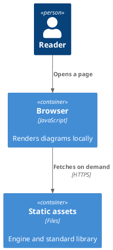

# PlantUML and Graphviz diagrams in Docusaurus

Every diagram on this site was rendered **by your browser**, from PlantUML or Graphviz source
embedded in Markdown. No diagram source was sent anywhere. There is no PlantUML server, no
Kroki, no Java, no Graphviz installation, and no CDN involved.

Open your browser's network tab and look: the only requests are to this site's own origin.

## Install

```bash
npm install @matfsw/docusaurus-plantuml-plugin
```

```ts title="docusaurus.config.ts"
import type {PlantUmlPluginOptions} from '@matfsw/docusaurus-plantuml-plugin';

export default {
  plugins: [
    [
      '@matfsw/docusaurus-plantuml-plugin',
      {theme: 'auto', lazy: true} satisfies PlantUmlPluginOptions,
    ],
  ],
};
```

That is the entire setup. No swizzling, no per-page imports.

## Write a diagram

Put PlantUML in a fenced code block using the `plantuml` (or `puml`) language:

````markdown

````

Which renders as:


## …or write Graphviz

`dot`, `graphviz` and `gv` fences are laid out by Graphviz instead:

````markdown

````

Which renders as:



**This costs nothing extra.** PlantUML uses Graphviz for its own layout, so the plugin has
always shipped and loaded the Graphviz engine. DOT fences reuse it — if your site already
renders PlantUML, Graphviz support adds zero bytes to what your readers download. The reverse
holds too: a page with only DOT diagrams never fetches the much larger PlantUML engine.

See the [Graphviz gallery page](/docs/gallery/graphviz) for layout engines, clusters, record
and HTML labels, and how colours behave in dark mode.

## …and the standard library works out of the box

`!include <C4/C4_Container>` needs no configuration and nothing installed. Write the include
and the diagram renders:



Eight namespaces ship with the plugin, and a page downloads **only the ones its own diagrams
include** — a C4 page costs 29 KB gzipped, and a page with no standard library include costs
nothing at all. As always, the bundles come from this site's own origin.

| Namespace                                 | What it gives you                          | Transfer |
| ----------------------------------------- | ------------------------------------------ | -------- |
| [`c4`](/docs/stdlib/c4)                   | C4-PlantUML: context, container, component, dynamic, deployment, sequence | 29 KB |
| [`archimate`](/docs/stdlib/notations)     | ArchiMate business/application/technology layers | 34 KB |
| [`eip`](/docs/stdlib/notations)           | Enterprise integration patterns            | 21 KB    |
| [`k8s`](/docs/stdlib/sprites)             | Kubernetes resources, as macros            | 23 KB    |
| [`kubernetes`](/docs/stdlib/sprites)      | The same icon set, as bare sprites         | 221 KB   |
| [`azure`](/docs/stdlib/sprites)           | Azure service icons                        | 160 KB   |
| [`office`](/docs/stdlib/sprites)          | Microsoft Office stencils                  | 160 KB   |
| [`cloudinsight`](/docs/stdlib/sprites)    | Databases, brokers, languages, runtimes    | 24 KB    |

Includes that the library makes of *itself* are resolved too: `C4_Container` pulls in
`C4_Context`, `k8s/Common` pulls in `<c4/…>`, and none of that has to be written in the fence.
Both spellings of an include work — `<C4/C4_Container>` and `<C4/C4_Container.puml>`.

### Everything else in the standard library

The library in full is 265 MB of source. `aws` alone is 114 MB, and `ibm`, `tupadr3` and the
Material icon sets account for most of the rest; several other namespaces declare no licence
upstream at all, which makes redistributing them a site owner's decision rather than the
plugin's. None of those ship with the plugin — but any of them can be used from a checkout you
control:

```bash
git clone --depth 1 https://github.com/plantuml/plantuml-stdlib vendor/plantuml-stdlib
```

```ts title="docusaurus.config.ts"
{
  stdlib: {
    include: ['aws', 'tupadr3'],
    source: 'vendor/plantuml-stdlib/stdlib',
  },
}
```

Those namespaces are bundled during the build and cached, so only the first build pays for it.
Naming a namespace that *is* bundled replaces it with your copy, which is also how you pin a
newer C4 than the one shipped.

If a diagram includes a namespace the site does not have, the panel says so and names the
option that adds it, instead of showing PlantUML's grey parsing-error card.

See the [standard library pages](/docs/stdlib/c4) for what each namespace looks like.

## Options

Every option is optional. These are the defaults:

| Option              | Default                  | What it does                                                    |
| ------------------- | ------------------------ | --------------------------------------------------------------- |
| `languages`         | `['plantuml', 'puml']`   | Fence languages treated as PlantUML. Matched case-insensitively. |
| `theme`             | `'auto'`                 | `auto` follows the site colour mode; or pin `light` / `dark`.    |
| `lazy`              | `true`                   | Render only when the diagram nears the viewport.                 |
| `cache`             | `'memory'`               | `none`, `memory`, or `session` (survives page reloads).          |
| `sanitizeSvg`       | `true`                   | Run rendered SVG through DOMPurify before inserting it.          |
| `showSourceOnError` | `true`                   | Offer the source in a `<details>` block when rendering fails.    |
| `renderTimeoutMs`   | `20000`                  | Abort a single render after this long.                           |
| `cacheMaxEntries`   | `50`                     | Bound on cached diagrams.                                        |
| `zoom`              | `true`                   | Let readers zoom and pan. Override per fence with `zoom=false`.  |
| `graphviz`          | see below                | Graphviz/DOT support.                                            |
| `stdlib`            | see below                | PlantUML standard library. `stdlib: false` switches it off.      |

Everything except `theme` applies to both engines. `theme` is PlantUML-only: Graphviz has no
dark palette, so its colours are adapted with CSS instead of being re-rendered.

### Graphviz options

| Option                            | Default                     | What it does                                                     |
| --------------------------------- | --------------------------- | ---------------------------------------------------------------- |
| `graphviz.enabled`                | `true`                      | Intercept DOT fences. `false` leaves them as code blocks.        |
| `graphviz.languages`              | `['dot', 'graphviz', 'gv']` | Fence languages treated as Graphviz.                             |
| `graphviz.engine`                 | `'dot'`                     | Default layout engine.                                           |
| `graphviz.allowEngineOverride`    | `true`                      | Let a fence pick its own engine with `engine=neato`.             |
| `graphviz.maxSourceBytes`         | `100000`                    | Refuse larger sources — Graphviz lays out synchronously.         |
| `graphviz.transparentBackground`  | `true`                      | Drop Graphviz's opaque white background.                         |

### Standard library options

| Option              | Default | What it does                                                                   |
| ------------------- | ------- | ------------------------------------------------------------------------------ |
| `stdlib.enabled`    | `true`  | Resolve `!include <namespace/…>`. `stdlib: false` is shorthand for turning it off. |
| `stdlib.include`    | `[]`    | Extra namespaces beyond the eight bundled ones. Each must be found in `source`. |
| `stdlib.source`     | `[]`    | `stdlib` directories of plantuml-stdlib checkouts. Required whenever `include` is set. |
| `stdlib.namespaces` | all     | Narrow which bundled namespaces the build emits. Dependencies are kept regardless. |

Namespaces are matched case-insensitively, because the engine lower-cases `<C4/…>` before it
looks anything up.

Invalid option values fail the build with an explicit message rather than being ignored — one
level deep too, so `graphviz: {enigne: 'neato'}` is a build error rather than a silent no-op,
and `stdlib.include: ['aws']` without a `stdlib.source` to read it from fails naming the
namespace.

## What to look at

The **Diagram gallery** shows the range of diagram types PlantUML supports, including the ones
that need Graphviz layout, and finishes with a [Graphviz page](/docs/gallery/graphviz) written
in plain DOT.

**Standard library** shows what the bundled namespaces look like: [C4](/docs/stdlib/c4),
[ArchiMate and EIP](/docs/stdlib/notations), and the [icon sets](/docs/stdlib/sprites).

**Plugin behaviour** demonstrates the things that are easy to get wrong: dark mode, several
diagrams on one page, invalid source, and leaving ordinary code blocks alone.

The [playground](/playground) lets you type your own PlantUML and watch it render as you go —
same renderer, same browser, still no network call.
