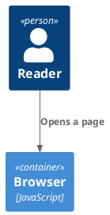
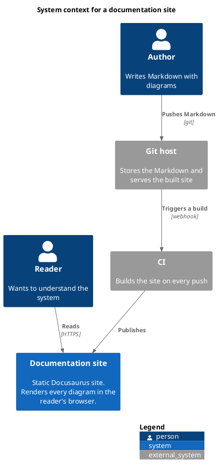
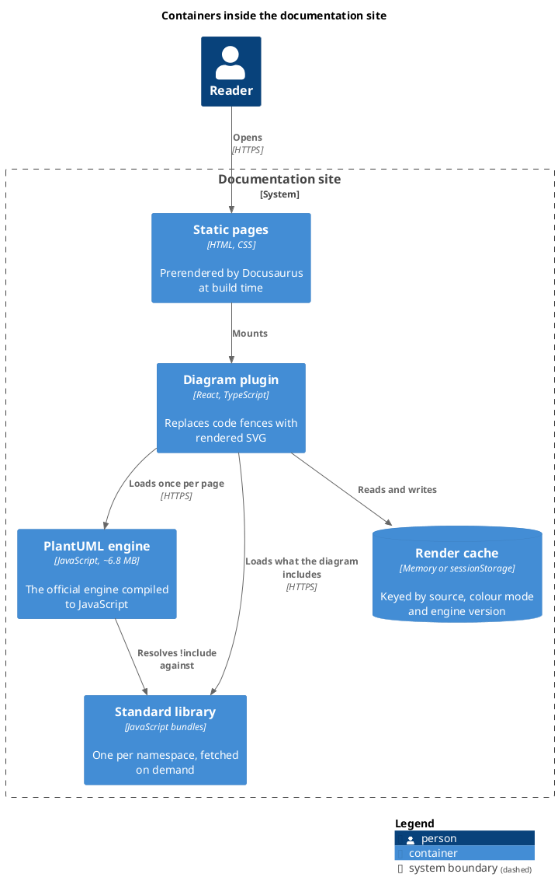
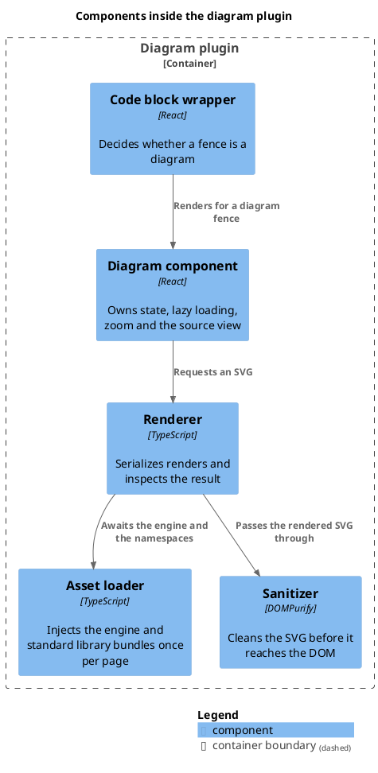
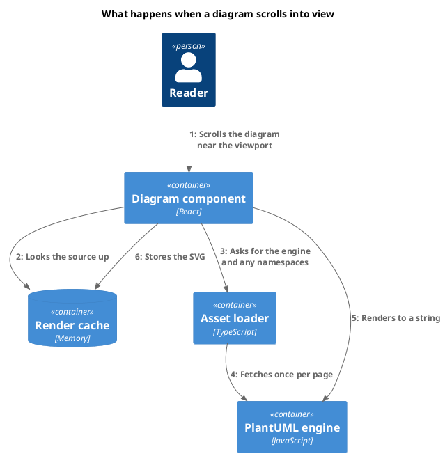
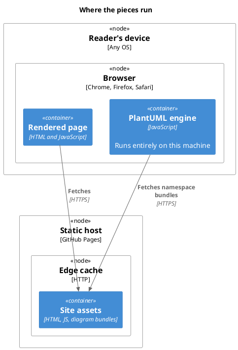
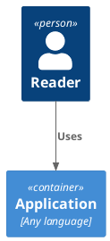

# C4 diagrams

[C4-PlantUML](https://github.com/plantuml-stdlib/C4-PlantUML) ships with the plugin. Write the
include and the diagram renders — no configuration, no separate download to arrange, and the
library is served from this site's own origin like everything else here.

````markdown

````

Only the namespaces a page actually includes are fetched. This page costs 29 KB gzipped for
C4; a page without a standard library include costs nothing at all.

## Level 1 — system context



## Level 2 — containers



## Level 3 — components



## Dynamic diagram

`C4_Dynamic` numbers the interactions in order rather than laying out structure.



## Deployment diagram



## Both spellings of the include

C4-PlantUML's own documentation writes the include with the `.puml` extension. Both forms
resolve here, which is not true of the standard library bundles published upstream.



## Zoom, dark mode and the source view still apply

Nothing about the standard library is special. These diagrams zoom, follow the site's colour
mode, and expose their source through the `</>` control like every other diagram on this site —
try the toolbar on the container diagram above.
