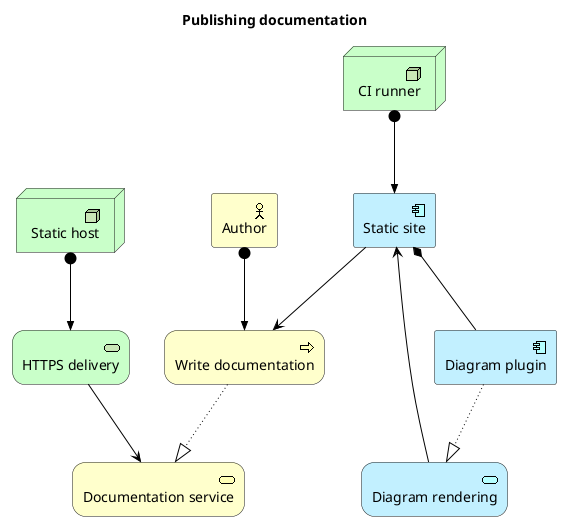
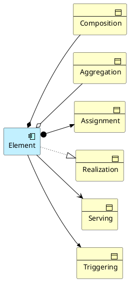
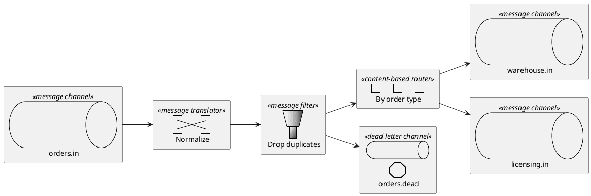
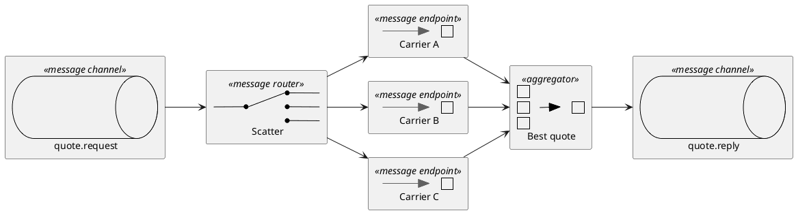
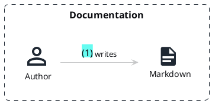

# ArchiMate and enterprise integration patterns

C4 gets the most attention, but two more modelling notations ship with the plugin. Each is a
macro library rather than a set of icons: you write `Business_Actor(...)` or `MsgChannel(...)`
and the library decides how it is drawn.

Each is one include, and each is fetched only by the pages that use it.

## ArchiMate

[Archimate-PlantUML](https://github.com/plantuml-stdlib/Archimate-PlantUML) covers the business,
application and technology layers, with ArchiMate's own relationship types.



Relationships carry ArchiMate's notation, so composition, realization, serving and assignment
are visually distinct:



## Enterprise integration patterns

[EIP-PlantUML](https://github.com/plantuml-stdlib/EIP-PlantUML) draws Hohpe and Woolf's
messaging patterns with their published symbols — channels, routers, filters, translators.





## A notation that needs a namespace we do not ship

Not every standard library namespace is self-contained. `DomainStory` is small and MIT
licensed, but every element it draws resolves an icon out of `material2.1.19` — 6.8 MB of
icons — so it cannot render on its own. It is not bundled for that reason, and a page that
includes it says so:



To use it, add both from a checkout:

```ts title="docusaurus.config.ts"
{
  stdlib: {
    include: ['domainstory', 'material2.1.19'],
    source: 'vendor/plantuml-stdlib/stdlib',
  },
}
```

## They compose with everything else

None of this is a special path through the plugin. These diagrams zoom, follow the site's
colour mode, show their source through the `</>` control, and are cached exactly like the
plain sequence diagram on the [start page](/docs/intro).
