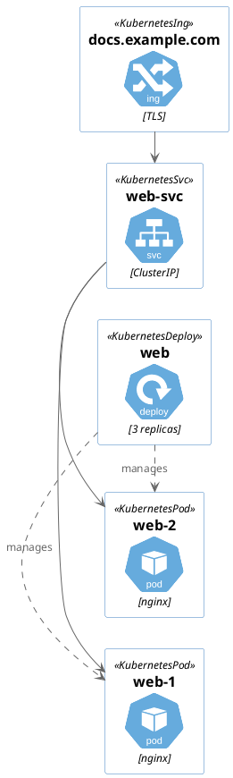
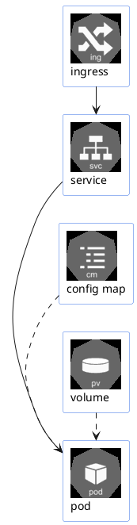
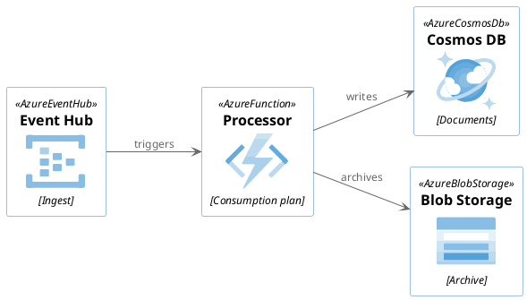
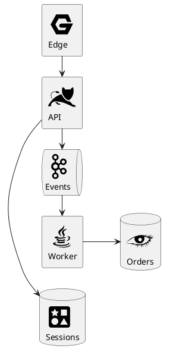
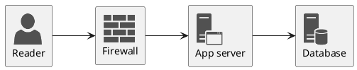

# Icon libraries

Five of the bundled namespaces are sprite libraries: icons you drop into a label with
`<$name>`, or macros that draw a labelled box around one.

Each namespace is a separate bundle, fetched only by the pages that include it. This page
loads five of them; the [C4 page](/docs/stdlib/c4) loads none of these.

## Kubernetes, with macros

`k8s` gives you a macro per resource type, drawing the icon, the name and a stereotype
together.

It also includes `<c4/…>` from inside its own `Common.puml`. The engine would only discover
that halfway through rendering, far too late to fetch anything, so the plugin resolves it up
front from an index built when the bundles were generated — the fence below says nothing about
C4.



## Kubernetes, as bare sprites

The separate `kubernetes` namespace is the same icon set without the macros — one include
brings in every sprite at a chosen size, and you place them yourself. Useful when you want the
icons inside your own shapes rather than the library's.



## Azure



## Cloudinsight

A general-purpose set covering the software most infrastructure diagrams need to name —
databases, brokers, languages, runtimes. One include per icon, referenced as `<$name>`.



## Office

Microsoft's stencil set, useful for deployment and network sketches. Sprites are referenced
with `<$name>` inside a label, so a single include gives you an icon you can put anywhere text
goes.



## What is not included

The full standard library is 265 MB of source, most of it icon sets: `aws` alone is 114 MB,
and `ibm`, `tupadr3` and the Material icon sets account for most of the rest. Several other
namespaces declare no licence upstream at all, which makes redistributing them the site
owner's decision rather than the plugin's. None of those ship with the plugin.

Any of them can be added from a local checkout:

```bash
git clone --depth 1 https://github.com/plantuml/plantuml-stdlib vendor/plantuml-stdlib
```

```ts title="docusaurus.config.ts"
{
  stdlib: {
    include: ['aws', 'tupadr3'],
    source: 'vendor/plantuml-stdlib/stdlib',
  },
}
```

A diagram that includes a namespace the site does not provide says exactly that, naming the
namespace and the option that adds it, rather than showing PlantUML's grey parsing-error card:

```plantuml title="A namespace this site does not provide"
@startuml
!include <aws/Common>
A -> B
@enduml
```


